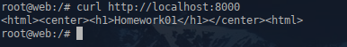

1. **Домашнее задание 1** 

Необходимо создать манифест namespace.yaml для
namespace с именем homework
Необходимо создать манифест pod.yaml. Он должен
описывать под, который:

* Будет создаваться в namespace homework
* Будет иметь контейнер, поднимающий веб-сервер на 8000 порту и отдающий содержимое папки /homework внутри этого контейнера.
* Будет иметь init-контейнер, скачивающий или генерирующий файл index.html и сохраняющий его в директорию /init
* Будет иметь общий том (volume) для основного и init-контейнера, монтируемый в директорию /homework первого и /init второго
* Будет удалять файл index.html из директории /homework основного контейнера, перед его завершением


<details>
  <summary>Решение:</summary>

Создаём манифест namespace.yaml

```
apiVersion: v1
kind: Namespace
metadata:
  name: homework
  labels:
    name: homework
```


Создаём манифест pod.yaml

```
apiVersion: v1
kind: Pod
metadata:
  namespace: homework
  name: web
  labels:
    app.kubernetes.io/name: web  
spec:

  nodeSelector:
    kubernetes.io/hostname: k8s-w001         # Указываем ноду для поднятия пода
  initContainers:
    - name: init
      image: alpine:latest
      command: ['sh', '-c', "echo '<html><center><h1>Homework01</h1></center><html>' > /init/index.html"]
      volumeMounts:
        - name: homework
          mountPath: "/init"
  containers:
    - name: web
      image: nginx:latest
      volumeMounts:
        - name: homework
          mountPath: "/homework"
        - name: default
          mountPath: "/etc/nginx/conf.d/default.conf"
      lifecycle:
        preStop:
          exec:
            command: ["/bin/sh", "-c", "rm /homework/index.html"]
      
      ports:
        - containerPort: 8000
          name: http
      
      
          
  volumes:
        - name: homework
          emptyDir: {}
        - name: default
          hostPath:
            path: /root/otus/nginx/default.conf     # Монтируемая конфигурация nginx
            type: File
			

```


Применяем:
```
kubectl apply -f namespace.yaml -f pod.yaml
```

Проверяем:
```
kubectl exec -ti web -n homework -- /bin/bash
```




</details>


