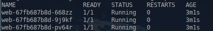
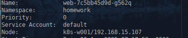
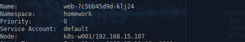

1. **Домашнее задание 2** 

Необходимо создать манифест namespace.yaml для namespace с именем homework
Необходимо создать манифест deployment.yaml. Он должен описывать deployment, который:

* Будет создаваться в namespace homework
* Запускает 3 экземпляра пода, полностью аналогичных по спецификации прошлому ДЗ.
* В дополнение к этому будет иметь readiness пробу, проверяющую наличие файла /homework/index.html
* Будет иметь стратегию обновления RollingUpdate, настроенную так, что в процессе обновления может быть недоступен максимум 1 под


<details>
  <summary>Решение:</summary>

Создаём манифест namespace.yaml

```
apiVersion: v1
kind: Namespace
metadata:
  name: homework
  labels:
    name: homework
```


Создаём манифест deployment.yaml

```
apiVersion: apps/v1
kind: Deployment
metadata:
  name: web
  namespace: homework
  labels:
    app.kubernetes.io/name: web
spec:
  replicas: 3
  strategy:
    type: RollingUpdate
    rollingUpdate:
      maxUnavailable: 1
      maxSurge: 1
  selector:
    matchLabels:
      app.kubernetes.io/name: web
  template:
    metadata:
      labels:
        app.kubernetes.io/name: web
    spec:
      nodeSelector:
        kubernetes.io/hostname: k8s-w001
      tolerations:
      - key: homework
        operator: Exists
        effect: NoExecute
      initContainers:
        - name: init
          image: alpine:latest
          command: ['sh', '-c', "echo '<html><center><h1>Homework02</h1></center><html>' > /init/index.html"]
          volumeMounts:
            - name: homework
              mountPath: "/init"
      containers:
        - name: web
          image: nginx:latest
          volumeMounts:
            - name: homework
              mountPath: "/homework"
            - name: default
              mountPath: "/etc/nginx/conf.d/default.conf"
          readinessProbe:
            exec:
              command: ['sh', '-c', "cat /homework/index.html"]
            initialDelaySeconds: 5
            periodSeconds: 5
          lifecycle:
            preStop:
              exec:
                command: ["/bin/sh", "-c", "rm /homework/index.html"]
      
          ports:
            - containerPort: 8000
              name: http
              
      volumes:
        - name: homework
          emptyDir: {}
        - name: default
          hostPath:
            path: /root/otus/nginx/default.conf
            type: File        
              
               
              
              
 
```


Применяем:
```
kubectl apply -f namespace.yaml -f deployment.yaml
```

Проверяем:
```
kubectl get po -n homework
```



```
kubectl exec -ti deploy/web -n homework -- /bin/bash
```


</details>


  1.1  ___Задание с *___
* Добавить к манифесту deployment-а спецификацию, обеспечивающую запуск подов деплоймента, только на нодах кластера, имеющих метку homework=true


<details>
  <summary>Решение:</summary>

Помечаем ноду таинтом
```
kubectl taint node k8s-w001 homework=true:NoExecute
```

В спецификацию шаблона пода, добавляем толерейшены
```
      tolerations:
      - key: homework
        operator: Exists
        effect: NoExecute

```

Применяем:
```
kubectl rollout restart deploy web -n homework
```

Проверяем:
```
kubectl describe po -n homework
```





</details>


