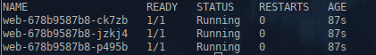
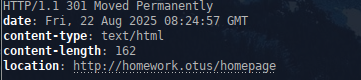

1. **Домашнее задание 3** 

* Изменить readiness-пробу в манифесте deployment.yaml из прошлого ДЗ на httpGet, вызывающую URL /index.html
* Необходимо создать манифест service.yaml, описывающий сервис типа ClusterIP, который будет направлять трафик на поды, управляемые вашим deployment
* Установить в кластер ingress-контроллер nginx 
* Создать манифест ingress.yaml, в котором будет описан объект типа ingress, направляющий все http запросы к хосту homework.otus на ранее созданный сервис. В результате запрос http://homework.otus/index.html должен отдавать код html
страницы, находящейся в подах


<details>
  <summary>Решение:</summary>


Добавляем на рабочей машине в /etc/hosts, запись соответствия homework.otus ip адресам кластера
```
192.168.15.106 homework.otus
192.168.15.107 homework.otus
192.168.15.108 homework.otus
```


Манифест deployment.yaml

```
apiVersion: apps/v1
kind: Deployment
metadata:
  name: web
  namespace: homework
  labels:
    app.kubernetes.io/name: web
spec:
  replicas: 3
  strategy:
    type: RollingUpdate
    rollingUpdate:
      maxUnavailable: 1
      maxSurge: 1
  selector:
    matchLabels:
      app.kubernetes.io/name: web
  template:
    metadata:
      labels:
        app.kubernetes.io/name: web
    spec:
      nodeSelector:
        kubernetes.io/hostname: k8s-w001
      tolerations:
      - key: homework
        operator: Exists
        effect: NoExecute
      initContainers:
        - name: init
          image: alpine:latest
          command: ['sh', '-c', "echo '<html><center><h1>Homework03</h1></center><html>' > /init/index.html"]
          
          volumeMounts:
            - name: homework
              mountPath: "/init"
      containers:
        - name: web
          image: nginx:latest
          volumeMounts:
            - name: homework
              mountPath: "/homework"
            - name: default
              mountPath: "/etc/nginx/conf.d/default.conf"
          readinessProbe:
            httpGet:
              path: /index.html
              port: 8000
            initialDelaySeconds: 5
            periodSeconds: 5  
  
          lifecycle:
            preStop:
              exec:
                command: ["/bin/sh", "-c", "rm -rf /homework/*"]
      
          ports:
            - containerPort: 8000
              name: http
              
      volumes:
        - name: homework
          emptyDir: {}
        - name: default
          hostPath:
            path: /root/otus/nginx/default.conf
            type: File 
            
```


Создаём манифест service.yaml

```
apiVersion: v1
kind: Service
metadata:
  namespace: homework
  name: web
  labels:
    app.kubernetes.io/name: web
spec:
  ports:
    - port: 8000
      targetPort: 8000      
  selector:
    app.kubernetes.io/name: web
  type: ClusterIP
  
```


Установил в кластер ingress-nginx-controller


Создаём манифест ingress.yaml

```
apiVersion: networking.k8s.io/v1 
kind: Ingress
metadata:
  name: web
  namespace: homework
  annotations:
    kubernetes.io/ingress.class: "nginx"
    nginx.ingress.kubernetes.io/configuration-snippet: |
      rewrite ^/index.html /homepage permanent;
spec:
  rules:
  - host: homework.otus
    http:
      paths:
      - pathType: Prefix
        path: /index.html
        backend:
          service:
            name: web
            port:
              number: 8000
  - host: homework.otus
    http:
      paths:
      - pathType: Prefix
        path: /homepage
        backend:
          service:
            name: web
            port:
              number: 8000

  ingressClassName: nginx
```


Применяем:
```
kubectl apply -f namespace.yaml -f deployment.yaml -f service.yaml -f ingress.yaml
```

Проверяем:
```
kubectl get po -n homework
```



```
curl http://homework.otus/index.html
```


</details>


  1.1  ___Задание с *___
*  Доработать манифест ingress.yaml, описав в нем rewrite-правила так, чтобы обращение по адресу http://homework.otus/index.html форвардилось на http://homework.otus/homepage


<details>
  <summary>Решение:</summary>

Добавляем в ingress.yaml аннотацию для редиректа
```
  annotations:
    nginx.ingress.kubernetes.io/configuration-snippet: |
      rewrite ^/index.html /homepage permanent;
```


Применяем:
```
kubectl delete -f ingress.yaml
kubectl apply -f ingress.yaml
```

Проверяем:
```
curl -I http://homework.otus/index.html
```




</details>


