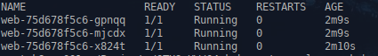
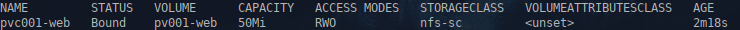
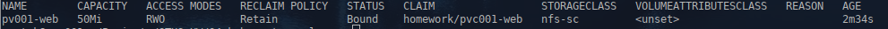
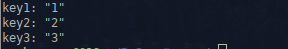
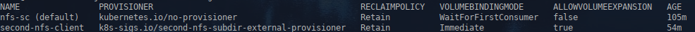
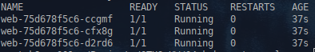
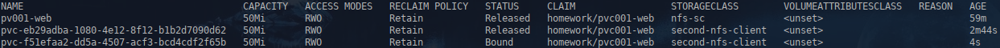
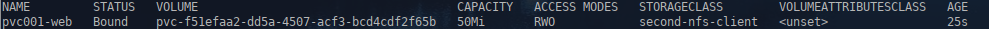

1. **Домашнее задание 4** 

* Создать манифест pvc.yaml, описывающий PersistentVolumeClaim, запрашивающий хранилище с storageClass по-умолчанию
* Создать манифест cm.yaml для объекта типа configMap, описывающий произвольный набор пар ключ-значение
* В манифесте deployment.yaml изменить спецификацию volume типа emptyDir, который монтируется в init и основной контейнер, на pvc, созданный в предыдущем пункте
* В манифесте deployment.yaml добавить монтирование ранее созданного configMap как volume к основному контейнеру пода в директорию /homework/conf, так, чтобы его содержимое можно было получить, обратившись по url
/conf/file


<details>
  <summary>Решение:</summary>

Создаём манифест nfs-sc.yaml создающий storageClass по умолчанию

```
apiVersion: storage.k8s.io/v1
kind: StorageClass
metadata:
  name: nfs-sc
  annotations:
    storageclass.kubernetes.io/is-default-class: "true"
provisioner: kubernetes.io/no-provisioner
reclaimPolicy: Retain
volumeBindingMode: WaitForFirstConsumer
  
```


Создаём PV, манифест pv.yaml 

```
apiVersion: v1
kind: PersistentVolume
metadata:
    name: pv001-web
    labels:
        type: nfs-store
spec:
    storageClassName: nfs-sc
    capacity:
        storage: 1Gi
    accessModes:
        - ReadWriteOnce
    hostPath:
        path: "/mnt/pvs/pv001-nfs"


```


Создаём манифест pvc.yaml

```
apiVersion: v1
kind: PersistentVolumeClaim
metadata:
  name: pvc001-web
  namespace: homework
spec:
  accessModes:
    - ReadWriteOnce
  resources:
    requests:
      storage: 50Mi
  storageClassName: "nfs-sc"
  
```


Создаём манифест cm.yaml

```
apiVersion: v1
kind: ConfigMap
metadata:
  name: web-nginx-configmap
  namespace: homework
data:
  default.conf: |-
    server {
    listen       8000;
    listen  [::]:8000;
    server_name  localhost;
    

    location / {
        root   /homework;
        index  index.html index.htm;
    
    }

    location /homepage {
        root   /homework;
        try_files $uri $uri/ /index.html;


    }

   


    error_page   500 502 503 504  /50x.html;
    location = /50x.html {
        root   /usr/share/nginx/html;
    }


    }
---


apiVersion: v1
kind: ConfigMap
metadata:
  namespace: homework
  name: test-web-configmap
data:
  file: |-
    key1: "1"  
    key2: "2"
    key3: "3"
  
```


Манифест deployment.yaml

```
apiVersion: apps/v1
kind: Deployment
metadata:
  name: web
  namespace: homework
  labels:
    app.kubernetes.io/name: web
spec:
  replicas: 3
  strategy:
    type: RollingUpdate
    rollingUpdate:
      maxUnavailable: 1
      maxSurge: 1
  selector:
    matchLabels:
      app.kubernetes.io/name: web
  template:
    metadata:
      labels:
        app.kubernetes.io/name: web
    spec:
      initContainers:
        - name: init
          image: alpine:latest
          command: ['sh', '-c', "echo '<html><center><h1>Homework04</h1></center><html>' > /init/index.html"]
          
          volumeMounts:
            - name: homework
              mountPath: "/init"
      containers:
        - name: web
          image: nginx:latest
          volumeMounts:
            - name: homework
              mountPath: "/homework"
            - name: default
              mountPath: "/etc/nginx/conf.d/"
            - name: config-volume
              mountPath: "/homework/conf/"
              readOnly: true
          readinessProbe:
            httpGet:
              path: /index.html
              port: 8000
            initialDelaySeconds: 5
            periodSeconds: 5  
  
          lifecycle:
            preStop:
              exec:
                command: ["/bin/sh", "-c", "rm -rf /homework/*"]
      
          ports:
            - containerPort: 8000
              name: http
              
      volumes:
        - name: homework
          persistentVolumeClaim:
            claimName: pvc001-web
        - name: default
          configMap:
            name: web-nginx-configmap       
        - name: config-volume
          configMap:
            name: test-web-configmap 
            
```


Манифест ingress.yaml

```
apiVersion: networking.k8s.io/v1 
kind: Ingress
metadata:
  name: web
  namespace: homework
  annotations:
    kubernetes.io/ingress.class: "nginx"
    nginx.ingress.kubernetes.io/configuration-snippet: |
      rewrite ^/index.html /homepage permanent;
spec:
  rules:
  - host: homework.otus
    http:
      paths:
      - pathType: Prefix
        path: /index.html
        backend:
          service:
            name: web
            port:
              number: 8000
  - host: homework.otus
    http:
      paths:
      - pathType: Prefix
        path: /homepage
        backend:
          service:
            name: web
            port:
              number: 8000
              
  - host: homework.otus
    http:
      paths:
      - pathType: Prefix
        path: /conf/file
        backend:
          service:
            name: web
            port:
              number: 8000

  ingressClassName: nginx
```


Применяем:
```
kubectl apply -f namespace.yaml -f pv.yaml -f nfs-sc.yaml -f pvc.yaml -f cm.yaml -f deployment.yaml -f service.yaml -f ingress.yaml 
```

Проверяем:
```
kubectl get po -n homework
```




```
kubectl get pv
```




```
kubectl get pvc -n homework
```


```
curl http://homework.otus/conf/file
```



</details>


  1.1  ___Задание с *___
*  Создать манифест storageClass.yaml описывающий объект типа storageClass с provisioner https://k8s.io/minikube-hostpath и reclaimPolicy Retain
*  Изменить манифест pvc.yaml так, чтобы в нем запрашивалось хранилище созданного вами storageClass


<details>
  <summary>Решение:</summary>

Устанавливаем nfs-subdir-external-provisioner
```
helm install second-nfs-subdir-external-provisioner nfs-subdir-external-provisioner/nfs-subdir-external-provisioner \
    --set nfs.server=y.y.y.y \
    --set nfs.path=/other/exported/path \
    --set storageClass.name=second-nfs-client \
    --set storageClass.provisionerName=k8s-sigs.io/second-nfs-subdir-external-provisioner \
    --set storageClass.reclaimPolicy=Retain
```


```
kubectl get sc
```



Меняем в манифесте pvc.yaml storageClassName

```
apiVersion: v1
kind: PersistentVolumeClaim
metadata:
  name: pvc001-web
  namespace: homework
spec:
  accessModes:
    - ReadWriteOnce
  resources:
    requests:
      storage: 50Mi
  storageClassName: "second-nfs-client"
  
```


Применяем:
```
kubectl delete -f deployment.yaml -f pvc.yaml
kubectl apply  -f pvc.yaml -f deployment.yaml
```

Проверяем:
```
kubectl get po -n homework
```

```
kubectl get pv
```


```
kubectl get pvc -n homework
```



</details>


