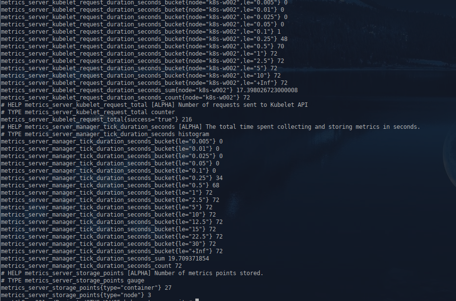
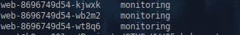
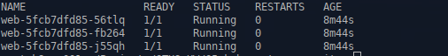
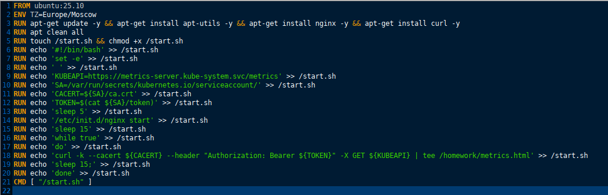
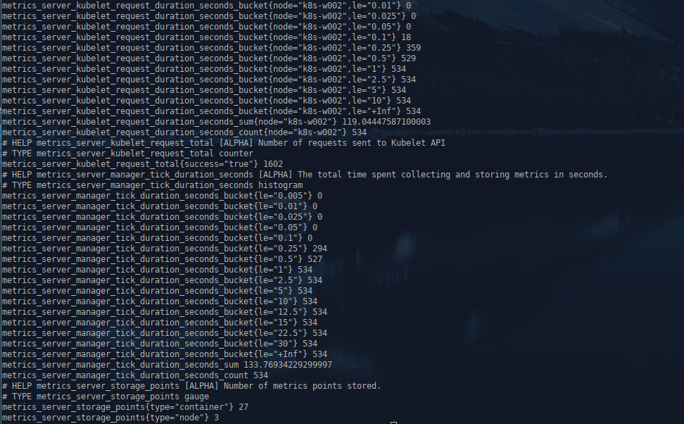

1. **Домашнее задание 5** 

* В namespace homework создать service account monitoring и дать ему доступ к эндпоинту /metrics вашего кластера
* Изменить манифест deployment из прошлых ДЗ так, чтобы поды запускались под service account monitoring
* В namespace homework создать service account с именем cd и дать ему роль admin в рамках namespace homework
* Создать kubeconfig для service account cd
* Сгенерировать для service account cd токен с временем действия 1 день и сохранить его в файл token


<details>
  <summary>Решение:</summary>


Создаём манифест сервисного аккаунта monitoring, кластерную роль role-monitoring c соответствующими правами и связываем кластерную роль с сервисным аккаунтом monitoring. Манифест monitoring-sa.yaml
```
apiVersion: v1
kind: ServiceAccount
metadata:
  name: monitoring
  namespace: homework
secrets:
  - name: monitoring-sa-token
  
---

apiVersion: rbac.authorization.k8s.io/v1
kind: ClusterRole
metadata:
  name: role-monitoring
rules:
  - nonResourceURLs: ["/metrics"]
    verbs: ["get"]
    
 
---

apiVersion: rbac.authorization.k8s.io/v1
kind: ClusterRoleBinding
metadata:
  name: role-monitoring
subjects:
  - kind: ServiceAccount
    name: monitoring
    namespace: homework
roleRef:
  kind: ClusterRole
  name: role-monitoring
  apiGroup: rbac.authorization.k8s.io
```

Применяем:
```
kubectl apply -f namespace.yaml -f monitoring-sa.yaml
```


Создаём токен для аккаунта мониторинг:
```
TOKEN=$(kubectl create token monitoring --duration=72h -n homework)
```

Преобразуем в base64:

```
echo -n "$TOKEN" | base64
```

Создаём секрет для monitoring, манифест monitoring-sa-token.yaml

```
apiVersion: v1
kind: Secret
metadata:
  name: monitoring-sa-token
  namespace: homework
  annotations:
    kubernetes.io/service-account.name: monitoring
type: kubernetes.io/service-account-token
data:
  token: |
    ZXlKaGJHY2lPaUpTVXpJMU5pSXNJbXRwWkNJNkltdE5Za3hXZFhOcWIxZG9WMk5VZEc5VFUxUXRk
    VlZqTjFkVU9VNVpiM0JTY0RKQk5ITkJkR3QyY2pBaWZRLmV5SmhkV1FpT2xzaWFIUjBjSE02THk5
    cmRXSmxjbTVsZEdWekxtUmxabUYxYkhRdWMzWmpMbU5zZFhOMFpYSXVhR1F1Ykc5allXd2lYU3dp
    Wlhod0lqb3hOelUxTkRNNE9UQXhMQ0pwWVhRaU9qRTNOVFV4TnprM01ERXNJbWx6Y3lJNkltaDBk
    SEJ6T2k4dmEzVmlaWEp1WlhSbGN5NWtaV1poZFd4MExuTjJZeTVqYkhWemRHVnlMbWhrTG14dlky
    RnNJaXdpYW5ScElqb2laVE5tTWpSa01UY3ROemM1WmkwME1HTXhMV0kyWW1RdFlXTm1NREZtWWpk
    aU16WXlJaXdpYTNWaVpYSnVaWFJsY3k1cGJ5STZleUp1WVcxbGMzQmhZMlVpT2lKb2IyMWxkMjl5
    YXlJc0luTmxjblpwWTJWaFkyTnZkVzUwSWpwN0ltNWhiV1VpT2lKdGIyNXBkRzl5YVc1bklpd2lk
    V2xrSWpvaU1XSXpOams1TWprdFpUa3hNUzAwWkdSbUxXSmlOR1V0WmpBNVpUZzJNV1F5TlRZd0lu
    MTlMQ0p1WW1ZaU9qRTNOVFV4TnprM01ERXNJbk4xWWlJNkluTjVjM1JsYlRwelpYSjJhV05sWVdO
    amIzVnVkRHBvYjIxbGQyOXlhenB0YjI1cGRHOXlhVzVuSW4wLmVDbVRXVDBUbUpKRHBlWUNMcUsy
    T2FVdkVqS1g2aTlLUHdfazRfbm02VW4wek5tLVJqNW1iTzFqd3hYcmRSNVFWaDI5dGFiWHdITm9k
    dXBKcHAzMU00bFBQSTBiYUNNRXl6OC1Bc001aVRfekxIeklHS2hFa1ZWSm5kZGZmRzVOeG84cFJ6
    VFNoQk9jWG1vNlp3bE5qQXA0LV9fTXFPRldxV255c1ZMbE9DTFJiTlhseTRleldXNkhpaDdpSE51
    N2NQcFFzV3RIN3dvcC1fWkpnUkZNcndaSXNWMlkzbDFOSy1QcjFVeV9rcXdWd3JhZ3YxUF95Sl9s
    WFZzODNCaEIyTnFjdDlXWkQ2MVJHb3hZNFNXd2VNeTFzUWtVMm8xdXBHc004ZXhjZWdrb0hZZkVC
    VDlJcmRvOXZ6eW5jdnQ5cUhwRWRkZUFqVUVIWW11aGhmR3FrUQ==
```

Применяем:
```
kubectl apply -f monitoring-sa-token.yaml
```

Изменяем манифест deployment.yaml чтобы под запускались из под аккаунта monitoring
```
spec:
      serviceAccountName: monitoring  # Подключаем сервисный аккаунт monitoring
      nodeSelector:
```
Применяем:
```
kubectl apply -f pvc.yaml -f cm.yaml -f deployment.yaml -f service.yaml -f ingress.yaml
```


Проверяем что метрики под данным аккаунтом можно получить и сервисы запущены под учеткой monitoring


```
curl -k -H "Authorization: Bearer ${TOKEN}" https://metrics-server.kube-system.svc.cluster.local/metrics
```


Проверяем что сервисы запущены под учеткой monitoring

```
kubectl get pods -n homework -o jsonpath="{range .items[*]}{.metadata.name}{'\t'}{.spec.serviceAccountName}{'\n'}{end}"
```



Создаём сервисный аккаунт и связываем его с кластерной ролью admin,  манифест cd-sa.yaml

```
apiVersion: v1
kind: ServiceAccount
metadata:
  name: cd
  namespace: homework
  
  
---

apiVersion: rbac.authorization.k8s.io/v1
kind: RoleBinding
metadata:
  name: cd-role-binding
  namespace: homework
subjects:
  - kind: ServiceAccount
    name: cd
    namespace: homework
roleRef:
  kind: ClusterRole
  name: admin
  apiGroup: rbac.authorization.k8s.io
```

Применяем:

```
kubectl apply -f cd-sa.yaml
```


Создаём токен и сохраняем в файл:

```
kubectl create token cd --duration=24h -n homework > cd-sa-token.txt
```

Получаем API сервера:
```
kubectl config view --minify -o jsonpath='{.clusters[0].cluster.server}'

```

Получаем рутовый сертификат:
```
kubectl get configmap kube-root-ca.crt -n homework -o jsonpath="{.data.ca\.crt}" > ca.crt
```

Присваиваем значения переменным и создаём cd-sa-kubeconfig.yaml

```
export SERVER=https://192.168.15.106:6443
export TOKEN=$(cat cd-sa-token.txt)

cat <<EOF > cd-kubeconfig.yaml
apiVersion: v1
kind: Config
clusters:
- cluster:
    certificate-authority: ca.crt
    server: ${SERVER}
  name: kubernetes
contexts:
- context:
    cluster: kubernetes
    namespace: homework
    user: cd
  name: cd-context
current-context: cd-context
users:
- name: cd
  user:
    token: ${TOKEN}
EOF
```

Проверяем 

```
KUBECONFIG=cd-kubeconfig.yaml kubectl get pods
```


</details>


  1.1  ___Задание с *___
*  Модифицировать deployment из прошлых ДЗ так, чтобы в процессе запуска pod происходило обращение к эндпоинту 
  /metrics вашего кластера (механика вызова не принципиальна), результат ответа сохранялся в файл
metrics.html и содержимое этого файла можно было бы получить при обращении по адресу /metrics.html вашего сервиса


<details>
  <summary>Решение:</summary>

Собираем кастомный образ включающий sh скрипт который с переодичностью 15 сек забирает метрики из metrics-server и вносит их в metrics.html.

Dockerfile:



Проверяем

```
curl http://homework.otus/metrics.html
```



</details>


