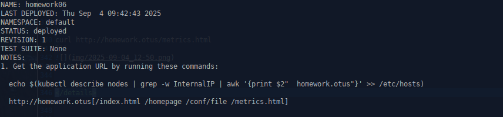
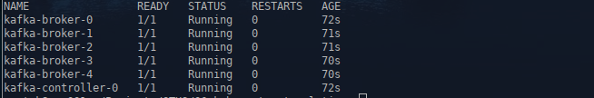

1. **Домашнее задание 6** 

* Создать helm-chart позволяющий деплоить приложение, которое у вас получилось при выполнении ДЗ 1-5. При
этом необходимо учесть:
  * Основные параметры в манифестах, такие как имена объектов, имена контейнеров, используемые образы,
хосты, порты, количество запускаемых реплик должны быть заданы как переменные в шаблонах и конфигурироваться через values.yaml либо через
параметры при установке релиза

  * Репозиторий и тег образа не должны быть одним параметром
  
  * Пробы должны быть включаемы/отключаемы через конфиг
  
  * В notes должно быть описано сообщение после установки релиза, отображающее адрес, по которому можно обратится к сервису

  * При именовании объектов в шаблонах старайтесь придерживаться best practice из лекции

  * Добавьте в свой чарт сервис-зависимость из доступных community-чартов. Например mysql или redis.


<details>
  <summary>Решение:</summary>


Создаем пустой helm chart
```
helm create homework-06
```

Шаблонизируем приложение в соответствии с заданными требованиями:

homework-06/templates/deployment.yaml
```

apiVersion: apps/v1
kind: Deployment
metadata:
  name: {{ .Values.Deployment.name }}
  namespace: {{ .Values.namespace.name }}
  labels:
    {{ .Values.Deployment.labels.key }}: {{ .Values.Deployment.labels.value }}
spec:
  replicas: {{ .Values.Deployment.replicaCount }}
  strategy:
    type: {{ .Values.Deployment.strategy.type }}
    rollingUpdate:
      maxUnavailable: {{ .Values.Deployment.strategy.maxUnavailable }}
      maxSurge: {{ .Values.Deployment.strategy.maxSurge }}
  selector:
    matchLabels:
       {{ .Values.Deployment.selector.key }}: {{ .Values.Deployment.selector.value }}
  template:
    metadata:
      labels:
        {{ .Values.Deployment.labels.key }}: {{ .Values.Deployment.labels.value }}
    spec:
      serviceAccountName: {{ .Values.SaMonitoringAccount.name }}
      nodeSelector:
        {{ .Values.Deployment.nodeSelector.key }}: {{ .Values.Deployment.nodeSelector.value }}
      tolerations:
      - key: {{ .Values.Deployment.tolerations.key }}
        operator: {{ .Values.Deployment.tolerations.operator }}
        effect: {{ .Values.Deployment.tolerations.effect }}
      initContainers:
        - name: {{ .Values.Deployment.initContainers.names.value1 }}
          image: {{ .Values.Deployment.initContainers.image.repository }}{{ .Values.Deployment.initContainers.image.tag }}
          command: ['sh', '-c', "echo '<html><center><h1>Homework06</h1></center><html>' > /init/index.html && touch /init/metrics.html"]
          volumeMounts:
            - name: {{ .Values.Deployment.initContainers.volumeMounts.name1 }}
              mountPath: {{ .Values.Deployment.initContainers.volumeMounts.path1 }}
              
        - name: {{ .Values.Deployment.initContainers.names.value2 }}
          image: {{ .Values.Deployment.initContainers.image.repository }}{{ .Values.Deployment.initContainers.image.tag }}
          command: ['sh', '-c', "/init/create-token.sh && sleep 3"]
          env:
            - name: SERVICEACCOUNTNAME
              value: {{ .Values.SaMonitoringAccount.name }}
            - name: NAMESPACE
              value: {{ .Values.namespace.name }}
      containers:
        - name: {{ .Values.Deployment.Containers.names.value }}
          image: {{ .Values.Deployment.Containers.image.repository }}{{ .Values.Deployment.Containers.image.tag }} 
          volumeMounts:
            - name: {{ .Values.Deployment.Containers.volumeMounts.name1 }} 
              mountPath: {{ .Values.Deployment.Containers.volumeMounts.path1 }}
            - name: {{ .Values.Deployment.Containers.volumeMounts.name2 }}
              mountPath: {{ .Values.Deployment.Containers.volumeMounts.path2 }}
            - name: {{ .Values.Deployment.Containers.volumeMounts.name3 }}
              mountPath: {{ .Values.Deployment.Containers.volumeMounts.path3 }}
              readOnly: true
{{- if .Values.Deployment.Containers.readinessProbe.enabled }}                # Пробы должны быть включаемы/отключаемы через конфиг
          readinessProbe:
            httpGet:
              path: {{ .Values.Deployment.Containers.readinessProbe.httpGet.path }}
              port: {{ .Values.Deployment.Containers.readinessProbe.httpGet.port }}
            initialDelaySeconds: {{ .Values.Deployment.Containers.readinessProbe.initialDelaySeconds }}
            periodSeconds: {{ .Values.Deployment.Containers.readinessProbe.periodSeconds }} 
{{- end }}
{{- if .Values.Deployment.Containers.lifecycle.enabled }}                    # Пробы должны быть включаемы/отключаемы через конфиг
          lifecycle:
            preStop:
              exec:
                command: ["/bin/sh", "-c", "rm -rf /homework/*"]
{{- end }}      
          ports:
            - containerPort: {{ .Values.Deployment.Containers.ports.containerPort }}
              name: {{ .Values.Deployment.Containers.ports.name }}
              
      volumes:
        - name: {{ .Values.Deployment.Containers.volumeMounts.name1 }}
          persistentVolumeClaim:
            claimName: {{ .Values.PersistentVolumeClaim.name }}
        - name: {{ .Values.Deployment.Containers.volumeMounts.name2 }}
          configMap:
            name: web-nginx-configmap       
        - name: {{ .Values.Deployment.Containers.volumeMounts.name3 }}
          configMap:
            name: test-web-configmap      
            
              
              

```


homework-06/values.yaml:
```

namespace:
  name: homework
  labels: homework


PersistentVolumeClaim:
  name: pvc001-web
  accessModes: ReadWriteOnce
  storage: 50Mi
  storageClassName: "second-nfs-client"


SaMonitoringAccount:
  name: monitoring
  secret: monitoring-sa-token
  role:  role-monitoring


Deployment:
  name: web
  labels:
    key: "app.kubernetes.io/name"
    value: web
  replicaCount: 3
  strategy:
    type: RollingUpdate
    maxUnavailable: 1
    maxSurge: 1
  selector:
    key: "app.kubernetes.io/name"
    value: web
  nodeSelector:
    key: "kubernetes.io/hostname"
    value: k8s-w001
  tolerations:
    key: homework
    operator: Exists
    effect: NoExecute
  initContainers:
    names:
      value1: init
      value2: token-init
    volumeMounts:
      name1: homework
      path1: "/init"
    image:
      repository: "rybnovn/alpine"   # Репозиторий и тег образа не должны быть одним параметром
      tag: ":1.1"
      pullPolicy: IfNotPresent
  Containers:
    names:
      value: web
    volumeMounts:
      name1: homework
      path1: "/homework"
      name2: default
      path2: "/etc/nginx/conf.d/"
      name3: config-volume
      path3: "/homework/conf/"
    image:
      repository: "rybnovn/nginx"   # Репозиторий и тег образа не должны быть одним параметром
      tag: ":1.2"
      pullPolicy: IfNotPresent      
    readinessProbe:
      enabled: false
      httpGet:
        path: /index.html
        port: 8000 
      initialDelaySeconds: 5
      periodSeconds: 5
    ports:
      containerPort: 8000
      name: http
    lifecycle:
      enabled: false
  
Service:
  port: 8000
  targetPort: 8000    
  type: ClusterIP  
  

ingress:
  enabled: true
  className: ""
  #annotations: {}
    # kubernetes.io/ingress.class: nginx
    # kubernetes.io/tls-acme: "true"
  hosts:
    - host: homework.otus
      paths:
        - path:
            - "/index.html"
            - "/homepage"
            - "/conf/file"
            - "/metrics.html" 
          pathType: Prefix
  serviceName:
    value1: web
  hostnames:
    value1: homework.otus
  SubPaths:
    value1: "/index.html"
    value2: "/homepage"
    value3: "/conf/file"
    value4: "/metrics.html" 
  servicePorts:
    value1: 8000  
  serviceName:
    value1: web
    
    
  #tls: []
  #  - secretName: chart-example-tls
  #    hosts:
  #      - chart-example.local
```


Добавление токена для сервисного аккаунта monitoring, будет по производится init контейнером, для этого в образ добавляем kubectl, config администратора и sh скрипт создающий токен.


create-token.sh:

```
#!/bin/sh
PATH=/sbin:/bin:/usr/sbin:/usr/bin:/usr/bin:/var/lib

if [ -f /init/${SERVICEACCOUNTNAME}-sa-token.yaml ]; then rm /init/${SERVICEACCOUNTNAME}-sa-token.yaml; fi;

cat <<EOF > /init/${SERVICEACCOUNTNAME}-sa-token.yaml
apiVersion: v1
kind: Secret
metadata:
  name: ${SERVICEACCOUNTNAME}-sa-token
  namespace: ${NAMESPACE}
  annotations:
    kubernetes.io/service-account.name: ${SERVICEACCOUNTNAME}
type: kubernetes.io/service-account-token
data:
  token: |
EOF


TOKEN=$(/init/kubectl create token ${SERVICEACCOUNTNAME} --duration=48h -n ${NAMESPACE}  --kubeconfig /init/config)
TOKEN=$(echo -n "$TOKEN" | base64)

echo ${TOKEN}  | tr ' ' '\n' |awk '{print "    "$1}' | tee -a /init/${SERVICEACCOUNTNAME}-sa-token.yaml
/init/kubectl apply -f /init/${SERVICEACCOUNTNAME}-sa-token.yaml --kubeconfig /init/config


rm /init/${SERVICEACCOUNTNAME}-sa-token.yaml
```


Далее добавляем в homework-06/charts сервис-зависимость mysql, mysql-1.0.0.tgz и описываем ее в файл Chart.yaml

homework-06/Chart.yaml
```
dependencies: 
  - name: mysql
    version: 1.0.0
    repository: file://../mysql
    condition: mysql.enabled
```


Устанавливаем helm chart:
```
helm install homework06 homework-06
```




```
kubectl get po -n homework
```


```
kubectl get secrets -n homework
```


```
curl http://homework.otus/metrics.html
```


</details>


  1.1  ___Задание 2___
* Установить kafka из bitnami helm-чарта. Релиз должен иметь следующие параметры:

  * Установлен в namespace prod

  * Должно быть развернуто 5 брокеров

  * Должна быть установлена kafka версии 3.5.2

  *  Для клиентских и межброкерных взаимодействий должен использоваться протокол SASL_PLAINTEXT

* Установить kafka из bitnami helm-чарта. Релиз должен иметь следующие параметры:

  *  Установлен в namespace dev

  *  Должно быть развернут 1 брокер

  *  Должна быть установлена последняя доступная версия kafka

  *  Для клиентских и межброкерных взаимодействий должен использоваться протокол PLAINTEXT, авторизация для подключения к кластеру отключена

* Описать 2 предыдущих сценария установки в helmfile и приложить получившийся helmfile.yaml (и иные файлы, если они будут)


<details>
  <summary>Решение:</summary>


Создаем неймспейсы prod и dev

```
kubectl create ns prod
kubectl create ns dev
```


Устанавливаем чарт с kafka версии 3.5.1 в неймспейс prod

```
helm install kafka kafka-25.3.5.tgz \
--set controller.replicaCount=1 --set controller.persistence.size=1Gi \
--set broker.replicaCount=5 --set broker.persistence.size=1Gi \
--set listeners.client.protocol=SASL_PLAINTEXT \
--set listeners.interbroker.protocol=SASL_PLAINTEXT --set controller.livenessProbe.enabled=false \
--set controller.readinessProbe.enabled=false --set broker.livenessProbe.enabled=false \
--set broker.readinessProbe.enabled=false --set networkPolicy.enabled=true -n prod
```


```
kubectl get po -n prod
```



Устанавливаем чарт с kafka версии 4.0.0 в неймспейс dev

```
helm install kafka kafka-32.4.2.tgz \
--set controller.replicaCount=1 --set controller.persistence.size=1Gi \
--set broker.replicaCount=1  --set broker.persistence.size=1Gi \
--set listeners.client.protocol=PLAINTEXT --set listeners.interbroker.protocol=PLAINTEXT \
--set networkPolicy.enabled=true -n dev

```


```
kubectl get po -n dev
```


Описываем установку helm чартов в helmfile.yaml:


```
---

releases:
  - namespace: dev
    name: kafka
    chart: kafka-32.4.2.tgz
    values:
      - controller:
          replicaCount: 1
          persistence:
            size: 1Gi
          logPersistence:
            size: 1Gi

          
        
        listeners:
          client:
            protocol: PLAINTEXT
          interbroker:
             protocol: PLAINTEXT
        networkPolicy:
          enabled: true
        
        
        
        broker:
          replicaCount: 1
          persistence:
            size: 1Gi
          logPersistence:
            size: 1Gi
            
  - namespace: prod
    name: kafka
    chart: kafka-25.3.5.tgz
    values:
      - controller:
          replicaCount: 1
          persistence:
            size: 1Gi
          logPersistence:
            size: 1Gi
          readinessProbe:
            enabled: false
          livenessProbe:
            enabled: false
        
        listeners:
          client:
            protocol: SASL_PLAINTEXT
          interbroker:
             protocol: SASL_PLAINTEXT
                
        
        broker:
          replicaCount: 5
          persistence:
            size: 1Gi
          logPersistence:
            size: 1Gi
          livenessProbe:
            enabled: false
          readinessProbe:
            enabled: false
        
        networkPolicy:
          enabled: true           
            
            
   
```


```
helmfile apply -f helmfile.yaml
```


</details>


