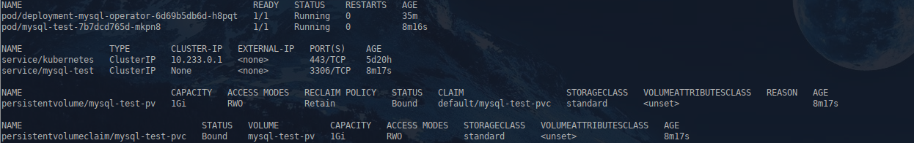
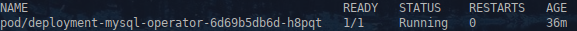
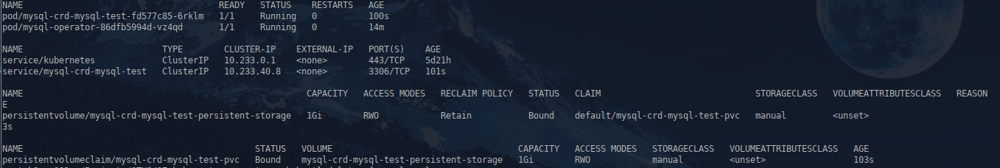
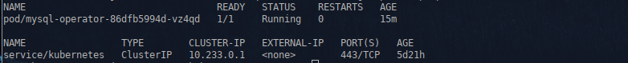

1. **Домашнее задание 7** 


* Создать манифест объекта CustomResourceDefinition со следующими параметрами:
  * Объект уровня namespace
  * Api group – otus.homework
  * Kind – MySQL
  * Plural name – mysqls
  * Версия – v1
  
* Объект должен иметь следующие обязательные атрибуты и правила их валидации(все поля строковые):
  * Image – определяет docker-образ для создания
  * Database – имя базы данных
  * Password – пароль от БД
  * Storage_size – размер хранилища под базу
  
  
* Создать манифесты ServiceAccount, ClusterRole и ClusterRoleBinding, описывающий сервис аккаунт с полными
правами на доступ к api серверу

* Создать манифест deployment для оператора, указав созданный ранее ServiceAccount и образ roflmaoinmysoul/mysql-operator:1.0.0

* Создать манифест кастомного объекта kind: MySQL валидный для применения (см. атрибуты CRD созданного ранее)
 * Применить все манифесты и убедиться, что CRD создался, оператор работает и при создании кастомного ресурса типа MySQL
создает Deployment с указанным образом mysql, service для него, PV и PVC. При удалении объекта типа MySQL удаляются все
созданные для него ресурсы


<details>
  <summary>Решение:</summary>


Создаем манифест объекта CustomResourceDefinition с требуемыми параметрами


CustomResourceDefinition.yaml:
```
apiVersion: apiextensions.k8s.io/v1
kind: CustomResourceDefinition
metadata:
  name: mysqls.otus.homework
  namespace: default
  finalizers: []
spec:
  group: otus.homework
  versions:
    - name: v1
      served: true
      storage: true
      schema:
        openAPIV3Schema:
          type: object
          properties:
            spec:
              type: object
              properties:
                image:
                  type: string
                database:
                  type: string
                password:
                  type: string
                storage_size:
                  type: string
              required:
              - image
              - database
              - password
              - storage_size
  scope: Namespaced
  names:
    plural: mysqls
    singular: mysql
    kind: MySQL
```

Применяем CRD:


```
apply -f ./CustomResourceDefinition.yaml

```


Проверяем

```
kubectl get crd | grep mysqls.otus.homework

```


Создаем ServiceAccount manager-sa, ClusterRole полного доступа к api и ClusterRoleBinding.


manager-sa.yaml:

```
apiVersion: v1
kind: ServiceAccount
metadata:
  name: manager-sa
  namespace: default

```


role-manager-admin.yaml

```

apiVersion: rbac.authorization.k8s.io/v1
kind: ClusterRole
metadata:
  name: role-manager
rules:
- apiGroups: ["*"]
  resources: ["*"]
  verbs: ["*"]


---


apiVersion: rbac.authorization.k8s.io/v1
kind: ClusterRoleBinding
metadata:
  name: role-manager-binding
subjects:
  - kind: ServiceAccount
    name: manager-sa
    namespace: default
roleRef:
  kind: ClusterRole
  name: role-manager
  apiGroup: rbac.authorization.k8s.io
```


Создаем манифест deployment-mysql-operator для оператора, указывая созданный
ранее сервисный акккаунт и образ roflmaoinmysoul/mysql-operator:1.0.0

deployment-mysql-operator.yaml
```
---
apiVersion: apps/v1
kind: Deployment
metadata:
  name: deployment-mysql-operator
spec:
  replicas: 1
  selector:
    matchLabels:
      app: mysql-operator
  template:
    metadata:
      labels:
        app: mysql-operator
    spec:
      serviceAccountName: manager-sa
      containers:
      - name: mysql-operator
        image: roflmaoinmysoul/mysql-operator:1.0.0
      restartPolicy: Always

```


Создаем манифест кастомного объекта kind: MySQL,  валидный для ранее созданного CRD

mysql.yaml
```
apiVersion: otus.homework/v1
kind: MySQL
metadata:
  name: mysql-test
  namespace: default
  finalizers: []
spec:
  image: rybnovn/mysql:1.0
  database: testdb
  password: secret
  storage_size: "1Gi"
```


Применяем:
```
kubectl apply -f ./manager-sa.yaml -f ./role-manager-admin.yaml -f ./mysql.yaml -f ./deployment-mysql-operator.yaml
```


Проверяем под какой учеткой запустился pod
```
kubectl get pods -n default -o jsonpath="{range .items[*]}{.metadata.name}{'\t'}{.spec.serviceAccountName}{'\n'}{end}" | grep deployment-mysql-operator
```


Смотрим что все ресурсы создались

```
kubectl get po,svc,pv,pvc
```




Удаляем объект типа MySQL

```
kubectl delete -f mysql.yaml 
```


Все созданные для него ресурсы удаляются

```
kubectl get pvc,pv 
```


```
kubectl get po
```




</details>


  1.1  ___Задание с *___
* Изменить манифест ClusterRole, описав в нем минимальный набор прав доступа необходимые для нашего CRD и убедиться что
функциональность не пострадала
  * Управление сами ресурсом CRD
  * Создание и удаление ресурсов типа Service, PV, PVC


<details>
  <summary>Решение:</summary>

Создаем манифест role-manager с минимальным набором прав доступа необходимых для нашего CRD

role-manager.yaml
```
apiVersion: rbac.authorization.k8s.io/v1
kind: ClusterRole
metadata:
  name: role-manager
rules:
- apiGroups: ["otus.homework"]
  resources: ["mysqls"]
  verbs: ["*"]
- apiGroups: [""]
  resources: ["services","persistentvolumes","persistentvolumeclaims","events"]
  verbs: ["*"]
- apiGroups: ["apps","extensions"]
  resources: ["deployments","deployments/status"]
  verbs: ["*"]
- apiGroups: ["events.k8s.io"]
  resources: ["events"]
  verbs: ["*"]
    
    
---

apiVersion: rbac.authorization.k8s.io/v1
kind: ClusterRoleBinding
metadata:
  name: role-manager-binding
subjects:
  - kind: ServiceAccount
    name: manager-sa
    namespace: default
roleRef:
  kind: ClusterRole
  name: role-manager
  apiGroup: rbac.authorization.k8s.io
```


</details>


  1.2  ___Задание с **___
* Создать свой оператор, который будет реализовывать следующий функционал
  * При создании в кластере объектов с типом MySQL (mysqls.otus.homework/v1) будет создавать deployment с
заданным образом mysql, сервис типа ClusterIP, PV и PVC заданного размера
  * При удалении объекта с типом MySQL будет удалять ранее созданные ресурсы


<details>
  <summary>Решение:</summary>

Для создания собственного оператора собираем кастомный образ, добавляем в него хуки и темплейты.

Dockerfile:
```
FROM ghcr.io/flant/shell-operator:v1.6.2
RUN apk add envsubst
ADD hooks /hooks
ADD templates /templates
RUN chmod +x /hooks/*

```

Создаем кастомный объект kind: MySQL

mysql.yaml
```
apiVersion: otus.homework/v1
kind: MySQL
metadata:
  name: mysql-test
  namespace: default
  finalizers: []
spec:
  image: rybnovn/mysql:1.0
  database: testdb
  password: secret
  storage_size: "1"
```


Применяем:
```
kubectl apply -f mysql.yaml
```


Создаем манифест deployment-operator-shell.yaml

```
apiVersion: apps/v1
kind: Deployment
metadata:
  name:  mysql-operator
  namespace: default
  labels:
    app:  mysql-operator
spec:
  selector:
    matchLabels:
      app: mysql-operator
  replicas: 1
  template:
    metadata:
      labels:
        app:  mysql-operator
    spec:
      serviceAccountName: manager-sa
      containers:
      - name:  mysql-operator
        image:  rybnovn/shell-operator:v1.6.2
        #imagePullPolicy: IfNotPresent
        imagePullPolicy: Always        
      restartPolicy: Always

```


Применяем:
```
kubectl apply -f deployment-operator-shell.yaml
```


Проверяем:
```
kubectl get po,svc,pv,pvc
```




Удаляем объект kind: MySQL

```
kubectl delete -f mysql.yaml 
```


Все созданные для него ресурсы удаляются

```
kubectl get po,svc,pv,pvc 
```




</details>


