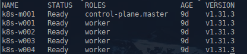
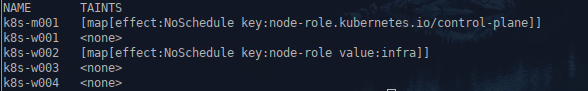
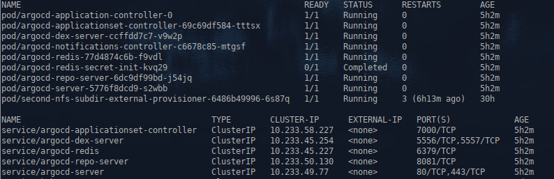
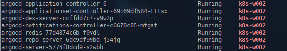
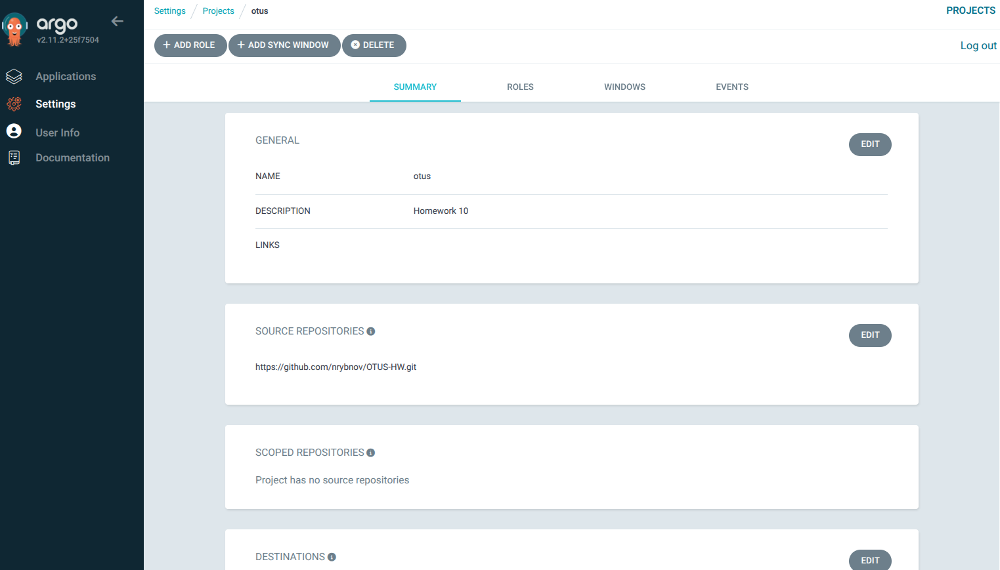
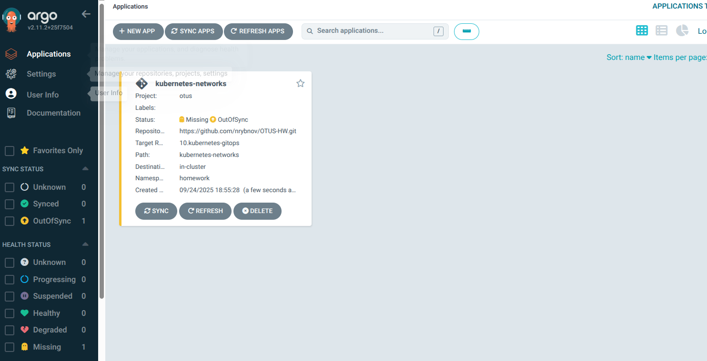
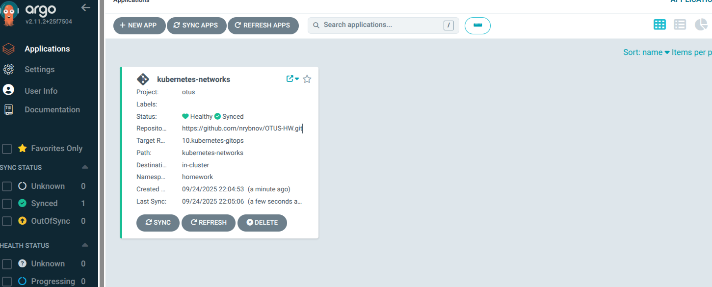
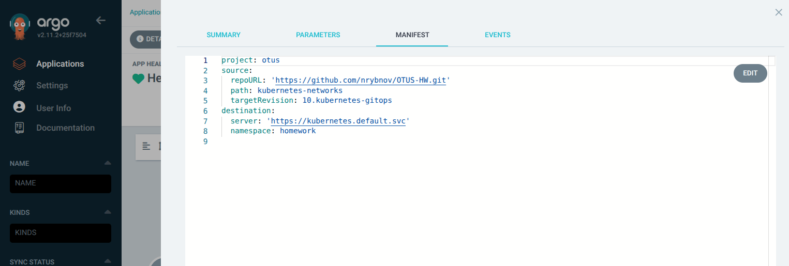

1. **Домашнее задание 10** 


* Данное задание будет выполняться в managed k8s в Yandex cloud
* Разверните managed Kubernetes cluster в Yandex cloud любым удобным вам способом
* Для кластера создайте 2 пула нод:
  * Для рабочей нагрузки (можно 1 ноду)
  * Для инфраструктурных сервисов (также хватит и 1 ноды)
* Для инфраструктурной ноды/нод добавьте taint, запрещающий на нее планирование подов с посторонней
нагрузкой - node-role=infra:NoSchedule
* Установите в кластер ArgoCD с помощью Helm-чарта
  *  Необходимо сконфигурировать параметры установки так, чтобы компоненты argoCD устанавливались
исключительно на infra-ноды (добавить соответствующий toleration для обхода taint, а также
nodeSelector или nodeAffinity на ваш выбор, для планирования подов только на заданные ноды)
  *  Приложите к ДЗ values.yaml конфигурации установки ArgoCD и команду самой установки чарта
* Создайте project с именем Otus
  *  В качестве Source-репозитория укажите ваш репозиторий с ДЗ курса
  *  В качестве Destination должен быть указан ваш кластер, в который установлен ArgoCD
  *  Приложите манифест, описывающий project к ДЗ


* Создайте приложение ArgoCD
  * В качестве репозитория укажите ваше приложение из ДЗ kubernetes-networks
  * Sync policy – manual
  * Namespace - homework
  * Проект – Otus. Убедитесь, что есть необходимые настройки, для создания и установки в namespace, который описан в ДЗ
kubernetes-networks
  * Убедитесь, что nodeSelector позволяет установить приложение на одну из нод кластера
  * Приложите манифест, описывающий установку приложения к результатам ДЗ
* Создайте приложение ArgoCD
  * В качестве репозитория укажите ваше приложение из ДЗ kubernetes-templating
  * Укажите директорию, в которой находится ваш helm-чарт,который вы разрабатывали самостоятельно
  * SyncPolicy – Auto, AutoHeal – true, Prune – true.
  * Проект – Otus.
  * Namespace – HomeworkHelm. Убедитесь, что установка чарта будет остуществляться в отличный от первого приложения
namespace.
  * Параметр, задающий количество реплик запускаемого приложения должен переопределяться в конфигурации
  * Приложите манифест, описывающий установку приложения к результатам ДЗ


<details>
  <summary>Решение:</summary>


Т.к. для ДЗ на моем стенде развернут k8s с пятью нодами, сервисы Яндекса использоваться не будут.





Для инфраструктурной ноды выбираем вторую воркер ноду, k8s-w002, и добавляем taint, запрещающий на нее планирование подов с посторонней нагрузкой.

```
kubectl taint node k8s-w002 node-role=infra:NoSchedule
```


```
kubectl get nodes -o custom-columns=NAME:.metadata.name,TAINTS:.spec.taints
```





Устанавливаем Argocd хельм чартом


values.yaml: 

```
---
global:
  tolerations:
  - key: "node-role"
    operator: "Equal"
    value: "infra"
    effect: "NoSchedule"
  affinity: 
    nodeAffinity:
      requiredDuringSchedulingIgnoredDuringExecution:
        nodeSelectorTerms:
        - matchExpressions:
          - key: role
            operator: In
            values:
            - infra
controller:
  tolerations:
  - key: "node-role"
    operator: "Equal"
    value: "infra"
    effect: "NoSchedule"
  affinity: 
    nodeAffinity:
      requiredDuringSchedulingIgnoredDuringExecution:
        nodeSelectorTerms:
        - matchExpressions:
          - key: role
            operator: In
            values:
            - infra
dex: 
  tolerations:
  - key: "node-role"
    operator: "Equal"
    value: "infra"
    effect: "NoSchedule"
  affinity: 
    nodeAffinity:
      requiredDuringSchedulingIgnoredDuringExecution:
        nodeSelectorTerms:
        - matchExpressions:
          - key: role
            operator: In
            values:
            - infra
redis:
  tolerations:
  - key: "node-role"
    operator: "Equal"
    value: "infra"
    effect: "NoSchedule"
  affinity: 
    nodeAffinity:
      requiredDuringSchedulingIgnoredDuringExecution:
        nodeSelectorTerms:
        - matchExpressions:
          - key: role
            operator: In
            values:
            - infra
server:
  tolerations:
  - key: "node-role"
    operator: "Equal"
    value: "infra"
    effect: "NoSchedule"
  affinity: 
    nodeAffinity:
      requiredDuringSchedulingIgnoredDuringExecution:
        nodeSelectorTerms:
        - matchExpressions:
          - key: role
            operator: In
            values:
            - infra
repoServer:
  tolerations:
  - key: "node-role"
    operator: "Equal"
    value: "infra"
    effect: "NoSchedule"
  affinity: 
    nodeAffinity:
      requiredDuringSchedulingIgnoredDuringExecution:
        nodeSelectorTerms:
        - matchExpressions:
          - key: role
            operator: In
            values:
            - infra
applicationSet:
  tolerations:
  - key: "node-role"
    operator: "Equal"
    value: "infra"
    effect: "NoSchedule"
  affinity: 
    nodeAffinity:
      requiredDuringSchedulingIgnoredDuringExecution:
        nodeSelectorTerms:
        - matchExpressions:
          - key: role
            operator: In
            values:
            - infra
notifications:
  tolerations:
  - key: "node-role"
    operator: "Equal"
    value: "infra"
    effect: "NoSchedule"
  affinity: 
    nodeAffinity:
      requiredDuringSchedulingIgnoredDuringExecution:
        nodeSelectorTerms:
        - matchExpressions:
          - key: role
            operator: In
            values:
            - infra

```


```
cd argocd
```


```
helmfile apply
```


```
kubectl get po,svc
```





Проверяем что argocd запустились на infra ноде:


```
kubectl get pod -o=custom-columns=NAME:.metadata.name,STATUS:.status.phase,NODE:.spec.nodeName --all-namespaces | grep  k8s-w002
```





Подключаемся с пробросом порта на порт argocd-server

```
ssh root@192.168.15.101 -L 8080:argocd-server.default.svc.cluster.local:80 
```


Вынимаем пароль admin

```
kubectl get secret argocd-initial-admin-secret -o jsonpath="{.data.password}" | base64 --decode ; echo
```


Заходим в веб интерфейс админки, создаем профиль otus




Далее идем к контейнер argocd-server и выполняем  команды в консоли:

```
kubectl exec -it service/argocd-server -- /bin/bash
# Авторизация
argocd login localhost:8080
# Список проектов
argocd proj list
# Подробная информация о проекте в yaml-формате для добавления в файл otus-project.yaml
argocd proj get otus -o yaml
```


Создаем папку kubernetes-networks в ветке проекта, и копирем туда файлы из ДЗ 03.kubernetes-networks.


Чтобы приложение kubernetes-networks развернулось, необходимо присвоить ноде метку:

```
kubectl label nodes k8s-w001 homework=true
```


В веб интерфейсе Argocd добавляем новое приложение kubernetes-networks.





Запускаем синхронизацию приложения kubernetes-networks.





Проверяем

```
kubectl get po -n homework
```


 Манифест, описывающий установку приложения





</details>


