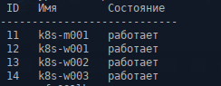
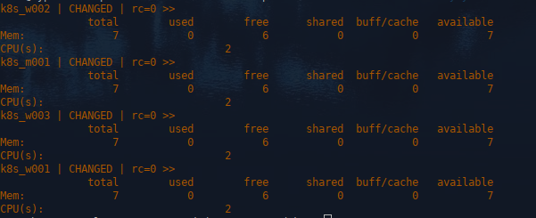
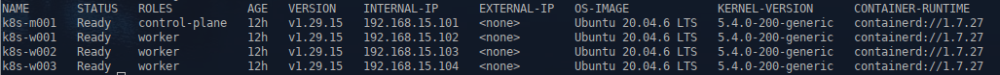
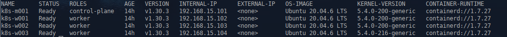
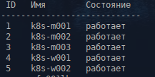
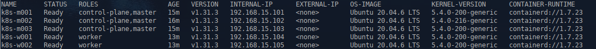

1. **Домашнее задание 14** 


* Для выполнения данного задания вам потребуется создать минимум 4 виртуальных машины в YC следующей конфигурации:
  *  Для master - 1 узел, 2vCPU, 8GB RAM
  *  Для worker – 3 узла, 2vCPU, 8GB RAM

* Версия создаваемого кластера должна быть на одну ниже чем актуальная версия kubernetes на момент выполнения (т.е если
последняя актуальная версия 1.30.x, то ставим 1.29.x)

* Выполните подготовительные работы на узлах в соответствии с инструкцией (отключить swap, включите маршрутизацию и т.д)

* Установите containerd, kubeadm, kubelet, kubectl на все ВМ

* Выполните kubeadm init на мастер-ноде 

* Установите Flannel в качестве сетевого плагина

* Выполните kubeadm join на воркер нодах

* Приложите к результатам ДЗ вывод команды kubectl get nodes -o wide, показывающий статус и версию k8s всех нод кластера

* Приложите к результатам ДЗ все команды, выполненные вами как на мастер, так и на воркер нодах (можно в readme, можно в виде .sh
скриптов, или иным образом как вам удобно) для возможности воспроизведения ваших действий

* Выполните обновление master ноды до последней актуальной версии k8s с помощью kubeadm

* Последовательно выведите из планирования все воркер-ноды, обновите их до последней актуальной версии и верните в
планирование

* Приложите к результатам ДЗ все команды по обновлению версии кластера, аналогично как вы делали это для команд установки

* Приложите к результатам ДЗ вывод команды kubectl get nodes -o wide, показывающий статус и версию k8s всех нод кластера после
обновления


<details>
  <summary>Решение:</summary>

Для выполнения ДЗ будем использовать стенд с установленным KVM (QEMU emulator version 7.2.13) и набором библиотек, инструментов и API libvirtd v 9.0.0.

Для массового создания - удаления ВМ, были написаны скрипты vm/create_vm.py,  vm/delete_vm.py, которые работают с csv файлом содержащим список с описанием ВМ.

Так же, для выполнения задания установим утилиту Ansible.


Устанавливаем ВМ:


kubernetes-prod_create_list.csv:


```
# Имя манины,кол-во ядер CPU,RAM,образ OS,диски, через пробел(название=емкость=тип=формат),тип OS,сеть
k8s-m001,2,8048,ubuntu-20.04-tmpl,"system=30=sata=qcow2",linux2022,"192.168.15.101"
k8s-w001,2,8048,ubuntu-20.04-tmpl,"system=30=sata=qcow2",linux2022,"192.168.15.102"
k8s-w002,2,8048,ubuntu-20.04-tmpl,"system=30=sata=qcow2",linux2022,"192.168.15.103"
k8s-w003,2,8048,ubuntu-20.04-tmpl,"system=30=sata=qcow2",linux2022,"192.168.15.104"
```


```
cd vm
./create_vm.py kubernetes-prod_create_list.csv 
```


Проверяем:

```
virsh list --all
```




```
ansible -bi inventory.yml -m shell -a "free -g | head -n 2 && lscpu | grep -w \"CPU(s)\" | head -n1"  all
```




Устанавливаем кластер k8s


Инвентарь для установки кластера

inventory.yml:


```
---
all:
  children:
    k8ss:
      hosts:
        k8s_m001:
          ansible_host: 192.168.15.101
          ansible_hn:  k8s-m001
          ansible_user: root
          ansible_password: 1234567
        k8s_w001:
          ansible_host: 192.168.15.102
          ansible_hn:  k8s-w001
          ansible_user: root
          ansible_password: 1234567
        k8s_w002:
          ansible_host: 192.168.15.103
          ansible_hn:  k8s-w002
          ansible_user: root
          ansible_password: 1234567
        k8s_w003:
          ansible_host: 192.168.15.104
          ansible_hn:  k8s-w003
          ansible_user: root
          ansible_password: 1234567

...

```


Плейбук для установки кластера

install_k8s_ubuntu.yml:

```

# Первоначальная настройка, минимальная установка софта

- name: "Rename master"
  hosts: k8ss:!k8s_w001:!k8s_w002:!k8s_w003
  become: true
  vars:
    node_fqdn: "{{ hostvars['k8s_m001']['ansible_hn'] }}"

  tasks:
  
  - name: "Rename k8s master {{ node_fqdn }}"
    shell:
      hostnamectl set-hostname {{ node_fqdn }}


- name: "Rename worker"
  hosts: k8ss:!k8s_m001:!k8s_w002:!k8s_w003
  become: true
  vars:
    node_fqdn: "{{ hostvars['k8s_w001']['ansible_hn'] }}"

  tasks:
  
  - name: "Rename k8s worker {{ node_fqdn }}"
    shell:
      hostnamectl set-hostname {{ node_fqdn }}


- name: "Rename worker"
  hosts: k8ss:!k8s_m001:!k8s_w001:!k8s_w003
  become: true
  vars:
    node_fqdn: "{{ hostvars['k8s_w002']['ansible_hn'] }}"

  tasks:
  
  - name: "Rename k8s worker {{ node_fqdn }}"
    shell:
      hostnamectl set-hostname {{ node_fqdn }}


- name: "Rename worker"
  hosts: k8ss:!k8s_m001:!k8s_w001:!k8s_w002
  become: true
  vars:
    node_fqdn: "{{ hostvars['k8s_w003']['ansible_hn'] }}"

  tasks:
  
  - name: "Rename k8s worker {{ node_fqdn }}"
    shell:
      hostnamectl set-hostname {{ node_fqdn }}


- hosts: k8ss
  become: true
  vars_files:
    - group_vars/current.yaml


  tasks:

  - name: "Add record in to /ets/hosts"
    ansible.builtin.lineinfile:
      path: /etc/hosts
      line: "{{ item.ip }} {{ item.name }}"
      state: present
    loop: "{{ cluster_hosts }}"


 
  - name: Creates directory if not exist
    ansible.builtin.file:
      path: /root/.ssh
      state: directory
      owner: "root"
      group: "root"
      mode: "0700"


  - name: "SSH: Copy private key "
    ansible.builtin.copy:
      src: "files/rsa/id_rsa"
      dest: "/root/.ssh/id_rsa"
      owner: "root"
      group: "root"
      mode: "0700"

  - name: "SSH: Copy public key "
    ansible.builtin.copy:
      src: "files/rsa/authorized_keys"
      dest: "/root/.ssh/authorized_keys"
      owner: "root"
      group: "root"
      mode: "0600"
  - name: "Reload ssh"
    ansible.builtin.service:
      name: "ssh"
      state: "reloaded"


  - name: "Make the Swap inactive"
    command: swapoff -a

  - name: "Remove Swap entry from /etc/fstab."
    lineinfile:
      dest: /etc/fstab
      regexp: swap
      state: absent

  - name:  "Clear REPO"
    shell:  "cat /dev/null > /etc/apt/sources.list"


  - name: "Insert addr in REPO"
    blockinfile:
      path: /etc/apt/sources.list
      block: |
        deb http://archive.ubuntu.com/ubuntu/ focal main restricted universe multiverse
        deb-src http://archive.ubuntu.com/ubuntu/ focal main restricted universe multiverse

        deb http://archive.ubuntu.com/ubuntu/ focal-updates main restricted universe multiverse
        deb-src http://archive.ubuntu.com/ubuntu/ focal-updates main restricted universe multiverse

        deb http://archive.ubuntu.com/ubuntu/ focal-security main restricted universe multiverse
        deb-src http://archive.ubuntu.com/ubuntu/ focal-security main restricted universe multiverse

        deb http://archive.ubuntu.com/ubuntu/ focal-backports main restricted universe multiverse
        deb-src http://archive.ubuntu.com/ubuntu/ focal-backports main restricted universe multiverse

        deb http://archive.canonical.com/ubuntu focal partner
        deb-src http://archive.canonical.com/ubuntu focal partner


  - name: Import repo keys
    shell:  "{{item}}"      
    loop:
      - apt-key adv --keyserver keyserver.ubuntu.com --recv-keys 112695A0E562B32A
      - apt-key adv --keyserver keyserver.ubuntu.com --recv-keys 54404762BBB6E853
      - apt-key adv --keyserver keyserver.ubuntu.com --recv-keys 648ACFD622F3D138
      - apt-key adv --keyserver keyserver.ubuntu.com --recv-keys 0E98404D386FA1D9
      - apt-key adv --keyserver keyserver.ubuntu.com --recv-keys DCC9EFBF77E11517
      - apt-key adv --keyserver keyserver.ubuntu.com --recv-keys 871920D1991BC93C


  - name: "Update REPO"
    shell:
      "apt update -y"
 

  - name: "Reboot systems"
    reboot:
      msg: 'Reboot initiate by Ansible'
      connect_timeout: 35
      reboot_timeout: 35
      pre_reboot_delay: 35
      post_reboot_delay: 60
      test_command: 'id'
     #when: not member.stat.exists 
    tags:
    - reboot 


  - name: "Installing soft"
    ansible.builtin.apt:
      name: "{{ item }}"
      state: "latest"
      update_cache: true
    with_items:
      - "curl"
      - "apt-transport-https"
      - "git"
      - "iptables-persistent"
      - "ca-certificates"
      - "gnupg-agent"
      - "software-properties-common"
      - "conntrack"
      - "aufs-tools"
      - "python3-apt"
      - "ethtool"
      - "rsync"
      - "python3"
      - "python3-pip"
      - "python3-setuptools"
      - "bridge-utils"
      - "mc"
      - "cloud-guest-utils"
      - "parted"
      - "nfs-common"


  - name: "Installing resolvconf"
    ansible.builtin.apt:
      name: "{{ item }}"
      state: "latest"
      update_cache: true
    with_items:
      - "resolvconf"


  - name: "Restore dns servers"
    shell:  "{{item}}"      
    loop:
      - cat /dev/null > /etc/resolv.conf
      - echo "nameserver 192.168.15.9" >> /etc/resolv.conf
      - echo "nameserver 192.168.15.1" >> /etc/resolv.conf


- hosts: k8ss
  become: true
  tasks:
  - name: "Reboot systems"
    reboot:
      msg: 'Reboot initiate by Ansible'
      connect_timeout: 35
      reboot_timeout: 35
      pre_reboot_delay: 35
      post_reboot_delay: 60
      test_command: 'id'
     #when: not member.stat.exists 
    tags:
    - reboot 


# Установка и настройка containerd.io, kubelet, kubeadm, kubectl


- hosts: k8ss
  become: true
  tasks:


  - name: Creates directory keyrings if not exist
    ansible.builtin.file:
      path: /etc/apt/keyrings
      state: directory
      owner: "root"
      group: "root"
      mode: "0755"


  - name: Remove file repo if exist
    ansible.builtin.file:
      path: "{{item}}"
      state: absent
    loop:
      - "/usr/share/keyrings/docker-archive-keyring.gpg"
      - "/etc/apt/sources.list.d/docker.list"
      - "/etc/apt/keyrings/kubernetes-apt-keyring.gpg"
      - "/etc/apt/sources.list.d/kubernetes.list"


  - name: "Add new repo kubernetes and containerd"
    shell:  "{{item}}"      
    loop:
      - curl -fsSL https://download.docker.com/linux/ubuntu/gpg | gpg --dearmor -o /usr/share/keyrings/docker-archive-keyring.gpg
      - echo "deb [arch=$(dpkg --print-architecture) signed-by=/usr/share/keyrings/docker-archive-keyring.gpg] https://download.docker.com/linux/ubuntu $(lsb_release -cs) stable" | tee /etc/apt/sources.list.d/docker.list
      - curl -fsSL https://pkgs.k8s.io/core:/stable:/v1.29/deb/Release.key | gpg --dearmor -o /etc/apt/keyrings/kubernetes-apt-keyring.gpg
      - echo "deb [signed-by=/etc/apt/keyrings/kubernetes-apt-keyring.gpg] https://pkgs.k8s.io/core:/stable:/v1.29/deb/ /" | tee /etc/apt/sources.list.d/kubernetes.list


  - name: "Installing kubernetes"
    ansible.builtin.apt:
      name: "{{ item }}"
      state: "latest"
      update_cache: true
    with_items:
      - "containerd.io"
      - "kubelet"
      - "kubeadm"
      - "kubectl"


  - name: "Copy config containerd "
    ansible.builtin.copy:
      src: "files/config.toml"
      dest: "/etc/containerd/config.toml"
      owner: "root"
      group: "root"
      mode: "0755"


  - name: "Creating an empty file containerd.conf for autoload modules"
    file:
      path: "/etc/modules-load.d/containerd.conf"
      state: touch


  - name: "Enable modules for containerd"
    blockinfile:
      path: /etc/modules-load.d/containerd.conf
      block: |
        overlay
        br_netfilter


  - name: "Creating empty sysctl-config file: /etc/sysctl.d/99-kubernetes-cri.conf"
    file:
      path: "/etc/sysctl.d/99-kubernetes-cri.conf"
      state: touch


  - name: "Enable sysctl options for kubernetes-cri"
    blockinfile:
      path: /etc/sysctl.d/99-kubernetes-cri.conf
      block: |
        net.bridge.bridge-nf-call-iptables = 1
        net.ipv4.ip_forward = 1
        net.bridge.bridge-nf-call-ip6tables = 1


  - name: "Load modules and restart sysctl"
    shell:
      modprobe br_netfilter
      modprobe overlay
      "sysctl --system"


  - name: Enable resolvconf service
    shell:  "{{item}}"      
    loop:
      - systemctl enable resolvconf.service
      - systemctl start resolvconf.service
      - systemctl start systemd-resolved.service
      - systemctl enable systemd-resolved.service
      - systemctl status resolvconf.service
      - systemctl status systemd-resolved.service


  - name: Start services k8s
    shell:  "{{item}}"      
    loop:
      - systemctl restart containerd
      - apt-mark hold kubelet kubeadm kubectl


  - name: "Apply iptables for k8s worker node"
    shell:
      "iptables -I INPUT 1 -p tcp --match multiport --dports 10250,30000:32767 -j ACCEPT && netfilter-persistent save"


- name: "Iptables rules for master"
  become: true
  hosts: k8ss:!k8s_w001:!k8s_w002:!k8s_w003
    
  tasks:
  - name: "Apply iptables for k8s master"
    shell:
      "iptables -I INPUT 1 -p tcp --match multiport --dports 6443,2379:2380,10250:10252 -j ACCEPT && netfilter-persistent save"
      


- hosts: k8ss
  become: true
  tasks:
  - name: "Reboot systems"
    reboot:
      msg: 'Reboot initiate by Ansible'
      connect_timeout: 15
      reboot_timeout: 15
      pre_reboot_delay: 15
      post_reboot_delay: 60
      test_command: 'id'
     #when: not member.stat.exists 
    tags:
    - reboot 


# Инициализация кластера и установка сетевого плагина kube-flannel


- hosts: k8ss:!k8s_w001:!k8s_w002:!k8s_w003
  become: true
  
    
  tasks:
  
  
  - name: "Copy kube-flannel"
    ansible.builtin.copy:
      src: "files/kube-flannel.yml"
      dest: "/root/kube-flannel.yml"
      owner: "root"
      group: "root"
      mode: "0755"  
  
  
  - name: Init cluster
    shell:  "{{item}}"      
    loop:
      - kubeadm init --pod-network-cidr=10.244.0.0/16

      

  - name: Setup cluster
    shell:  "{{item}}"      
    loop:
      - mkdir -p /root/.kube
      - cp -i /etc/kubernetes/admin.conf /root/.kube/config
      - kubectl apply -f /root/kube-flannel.yml


# kubeadm join на воркер нодах


- hosts: k8ss:!k8s_m001
  become: true

  tasks:
  
  - name: Get cluster token
    shell: ssh -o StrictHostKeyChecking=no -o UserKnownHostsFile=/dev/null  root@{{ hostvars['k8s_m001']['ansible_hn'] }} "kubeadm token create --print-join-command"
    register: cluster_token    
   

 
      
  - name: Join node in cluster
    shell: "{{ cluster_token.stdout }}"

      
  
  
  
# Добавления лейбла node-role=worker воркер нодам
      

- hosts: k8ss:!k8s_w001:!k8s_w002:!k8s_w003
  become: true
 

  tasks:
  
  - name: "Label worker nodes"
    shell:  "{{item}}"      
    loop:
      - kubectl label node {{ hostvars['k8s_w001']['ansible_hn'] }} node-role.kubernetes.io/worker=worker
      - kubectl label node {{ hostvars['k8s_w002']['ansible_hn'] }} node-role.kubernetes.io/worker=worker
      - kubectl label node {{ hostvars['k8s_w003']['ansible_hn'] }} node-role.kubernetes.io/worker=worker


```


Запускаем


```
cd ../
ansible-playbook -bi inventory.yml install_k8s_ubuntu.yml
```


Проверяем


```
ssh root@192.168.15.101
kubectl get nodes -o wide
```




Обновление кластера с 1.29.x до 1.30.x


Инвентарь остается тот же, используется плейбук upgrade_cluster.yaml


upgrade_cluster.yaml:

```
- hosts: k8ss
  become: true

  tasks:
  
 # Добавляем репозиторий с новой версией kubelet и kubectl
  
  - name: "Change repo for upgrade kubernetes"
    shell:  "{{item}}"      
    loop:
      - curl -fsSL https://pkgs.k8s.io/core:/stable:/v1.30/deb/Release.key | sudo gpg --dearmor -o /etc/apt/keyrings/kubernetes-apt-keyring-30.gpg
      - echo "deb [signed-by=/etc/apt/keyrings/kubernetes-apt-keyring-30.gpg] https://pkgs.k8s.io/core:/stable:/v1.30/deb/ /" | tee /etc/apt/sources.list.d/kubernetes.list


# Обновляем мастер ноду


- hosts: k8ss:!k8s_w001:!k8s_w002:!k8s_w003
  become: true

  tasks:


  - name: "Upgrade master node to 30"
    shell:  "{{item}}"      
    loop:
      - apt-mark unhold kubeadm
      - apt-get update
      - apt-get install -y kubeadm="1.30.3-*"
      - apt-mark hold kubeadm
      - kubeadm upgrade node


# Обновляем воркер ноды


- hosts: k8ss:!k8s_m001
  become: true

  tasks:


  - name: "Upgrade kubernetes to 30"
    shell:  "{{item}}"      
    loop:
      - kubectl drain $HOSTNAME --ignore-daemonsets
      - apt-mark unhold kubelet kubectl
      - apt-get install -y kubelet="1.30.3-*" kubectl="1.30.3-*"
      - apt-mark hold kubelet kubectl
      - systemctl daemon-reload
      - systemctl restart kubelet
      - kubectl uncordon $HOSTNAME
```


Запускаем


```
ansible-playbook -bi inventory.yml upgrade_cluster.yaml
```


Проверяем


```
ssh root@192.168.15.101
kubectl get nodes -o wide
```




Удаляем используемые ВМ:
```
vm/delete_vm.py vm/kubernetes-prod_delete_list.csv 
```


 


</details>


  1.1  ___Задание с *___
*  Создайте минимум 5 нод следующей конфигурации:
  *  Для master - 3 узла, 2vCPU, 8GB RAM
  *  Для worker – минимум 2 узла, 2vCPU, 8GB RAM

*  Разверните отказоустойчивый кластер K8s с помощью kubespray (3 master ноды, минимум 2 worker)
 
*  К результатам ДЗ приложите inventory файл который вы использовали для создания кластера и вывод команды kubectl get nodes -o wide

<details>
  <summary>Решение:</summary>
  
  
Создаем ВМ для задания

vm/kubernetes-prod_create_kubespray_list.csv:


```
# Имя манины,кол-во ядер CPU,RAM,образ OS,диски, через пробел(название=емкость=тип=формат),тип OS,сеть
k8s-m001,2,8048,ubuntu-20.04-tmpl,"system=30=sata=qcow2",linux2022,"192.168.15.101"
k8s-m002,2,8048,ubuntu-20.04-tmpl,"system=30=sata=qcow2",linux2022,"192.168.15.102"
k8s-m003,2,8048,ubuntu-20.04-tmpl,"system=30=sata=qcow2",linux2022,"192.168.15.103"
k8s-w001,2,8048,ubuntu-20.04-tmpl,"system=30=sata=qcow2",linux2022,"192.168.15.104"
k8s-w002,2,8048,ubuntu-20.04-tmpl,"system=30=sata=qcow2",linux2022,"192.168.15.105"
```


Выполняем:

```
vm/create_vm.py vm/kubernetes-prod_create_list.csv 
```


Проверяем:

```
virsh list --all
```


 


Подготавливаем ноды для развертывания кластера
  
```
cd kubespray
```  
  
Инвентарь

inventory.yml:

```
---
all:
  children:
    k8ss:
      hosts:
        k8s_m001:
          ansible_host: 192.168.15.101
          ansible_hn:  k8s-m001
          ansible_user: root
          ansible_password: 1234567
        k8s_m002:
          ansible_host: 192.168.15.102
          ansible_hn:  k8s-m002
          ansible_user: root
          ansible_password: 1234567
        k8s_m003:
          ansible_host: 192.168.15.103
          ansible_hn:  k8s-m003
          ansible_user: root
          ansible_password: 1234567
        k8s_w001:
          ansible_host: 192.168.15.104
          ansible_hn:  k8s-w001
          ansible_user: root
          ansible_password: 1234567
        k8s_w002:
          ansible_host: 192.168.15.105
          ansible_hn:  k8s-w002
          ansible_user: root
          ansible_password: 1234567


...
``` 
  
  
Используемый плейбук

preinstall_kubespay_ubuntu.yml:

  
```
- name: "Rename master001"
  hosts: k8ss:!k8s_m002:!k8s_m003:!k8s_w001:!k8s_w002
  become: true
  vars:
    node_fqdn: "{{ hostvars['k8s_m001']['ansible_hn'] }}"
  tasks:
  
  - name: "Rename k8s master {{ node_fqdn }}"
    shell:
      hostnamectl set-hostname {{ node_fqdn }}


- name: "Rename master002"
  hosts: k8ss:!k8s_m001:!k8s_m003:!k8s_w001:!k8s_w002
  become: true
  vars:
    node_fqdn: "{{ hostvars['k8s_m002']['ansible_hn'] }}"
  tasks:
  
  - name: "Rename k8s master {{ node_fqdn }}"
    shell:
      hostnamectl set-hostname {{ node_fqdn }}


- name: "Rename master003"
  hosts: k8ss:!k8s_m001:!k8s_m002:!k8s_w001:!k8s_w002
  become: true
  vars:
    node_fqdn: "{{ hostvars['k8s_m003']['ansible_hn'] }}"
  tasks:
  
  - name: "Rename k8s master {{ node_fqdn }}"
    shell:
      hostnamectl set-hostname {{ node_fqdn }}


- name: "Rename worker001"
  hosts: k8ss:!k8s_m001:!k8s_m002:!k8s_m003:!k8s_w002
  become: true
  vars:
    node_fqdn: "{{ hostvars['k8s_w001']['ansible_hn'] }}"

  tasks:
  
  - name: "Rename k8s worker {{ node_fqdn }}"
    shell:
      hostnamectl set-hostname {{ node_fqdn }}


- name: "Rename worker002"
  hosts: k8ss:!k8s_m001:!k8s_m002:!k8s_m003:!k8s_w001
  become: true
  vars:
    node_fqdn: "{{ hostvars['k8s_w002']['ansible_hn'] }}"

  tasks:
  
  - name: "Rename k8s worker {{ node_fqdn }}"
    shell:
      hostnamectl set-hostname {{ node_fqdn }}


- hosts: k8ss
  become: true
  vars_files:
    - group_vars/current.yaml


  tasks:

  - name: "Add record in to /ets/hosts"
    ansible.builtin.lineinfile:
      path: /etc/hosts
      line: "{{ item.ip }} {{ item.name }}"
      state: present
    loop: "{{ cluster_hosts }}"


 
  - name: Creates directory if not exist
    ansible.builtin.file:
      path: /root/.ssh
      state: directory
      owner: "root"
      group: "root"
      mode: "0700"


  - name: "SSH: Copy private key "
    ansible.builtin.copy:
      src: "../files/rsa/id_rsa"
      dest: "/root/.ssh/id_rsa"
      owner: "root"
      group: "root"
      mode: "0700"

  - name: "SSH: Copy public key "
    ansible.builtin.copy:
      src: "../files/rsa/authorized_keys"
      dest: "/root/.ssh/authorized_keys"
      owner: "root"
      group: "root"
      mode: "0600"
  - name: "Reload ssh"
    ansible.builtin.service:
      name: "ssh"
      state: "reloaded"


  - name: "Make the Swap inactive"
    command: swapoff -a

  - name: "Remove Swap entry from /etc/fstab."
    lineinfile:
      dest: /etc/fstab
      regexp: swap
      state: absent

  - name:  "Clear REPO"
    shell:  "cat /dev/null > /etc/apt/sources.list"


  - name: "Insert addr in REPO"
    blockinfile:
      path: /etc/apt/sources.list
      block: |
        deb http://archive.ubuntu.com/ubuntu/ focal main restricted universe multiverse
        deb-src http://archive.ubuntu.com/ubuntu/ focal main restricted universe multiverse

        deb http://archive.ubuntu.com/ubuntu/ focal-updates main restricted universe multiverse
        deb-src http://archive.ubuntu.com/ubuntu/ focal-updates main restricted universe multiverse

        deb http://archive.ubuntu.com/ubuntu/ focal-security main restricted universe multiverse
        deb-src http://archive.ubuntu.com/ubuntu/ focal-security main restricted universe multiverse

        deb http://archive.ubuntu.com/ubuntu/ focal-backports main restricted universe multiverse
        deb-src http://archive.ubuntu.com/ubuntu/ focal-backports main restricted universe multiverse

        deb http://archive.canonical.com/ubuntu focal partner
        deb-src http://archive.canonical.com/ubuntu focal partner


  - name: Import repo keys
    shell:  "{{item}}"      
    loop:
      - apt-key adv --keyserver keyserver.ubuntu.com --recv-keys 112695A0E562B32A
      - apt-key adv --keyserver keyserver.ubuntu.com --recv-keys 54404762BBB6E853
      - apt-key adv --keyserver keyserver.ubuntu.com --recv-keys 648ACFD622F3D138
      - apt-key adv --keyserver keyserver.ubuntu.com --recv-keys 0E98404D386FA1D9
      - apt-key adv --keyserver keyserver.ubuntu.com --recv-keys DCC9EFBF77E11517
      - apt-key adv --keyserver keyserver.ubuntu.com --recv-keys 871920D1991BC93C


  - name: "Update REPO"
    shell:
      "apt update -y"
 

  - name: "Reboot systems"
    reboot:
      msg: 'Reboot initiate by Ansible'
      connect_timeout: 35
      reboot_timeout: 35
      pre_reboot_delay: 35
      post_reboot_delay: 60
      test_command: 'id'
     #when: not member.stat.exists 
    tags:
    - reboot 


  - name: "Installing soft"
    ansible.builtin.apt:
      name: "{{ item }}"
      state: "latest"
      update_cache: true
    with_items:
      - "curl"
      - "apt-transport-https"
      - "git"
      - "iptables-persistent"
      - "ca-certificates"
      - "gnupg-agent"
      - "software-properties-common"
      - "conntrack"
      - "aufs-tools"
      - "python3-apt"
      - "ethtool"
      - "rsync"
      - "python3"
      - "python3-pip"
      - "python3-setuptools"
      - "bridge-utils"
      - "mc"
      - "cloud-guest-utils"
      - "parted"
      - "nfs-common"


  - name: "Installing resolvconf"
    ansible.builtin.apt:
      name: "{{ item }}"
      state: "latest"
      update_cache: true
    with_items:
      - "resolvconf"


  - name: "Restore dns servers"
    shell:  "{{item}}"      
    loop:
      - cat /dev/null > /etc/resolv.conf
      - echo "nameserver 192.168.15.9" >> /etc/resolv.conf
      - echo "nameserver 192.168.15.1" >> /etc/resolv.conf


- hosts: k8ss
  become: true
  tasks:
  - name: "Reboot systems"
    reboot:
      msg: 'Reboot initiate by Ansible'
      connect_timeout: 35
      reboot_timeout: 35
      pre_reboot_delay: 35
      post_reboot_delay: 60
      test_command: 'id'
     #when: not member.stat.exists 
    tags:
    - reboot 


```   
  
  
Запускаем

```
ansible-playbook -bi inventory.yml preinstall_kubespay_ubuntu.yml 
```  
  
  
  
  
  
После прокатки плейбука, разворачиваем кластер с помощью kubespray   
  
  
Инвентарь kubespray:


inventory/cluster/inventory.ini:

  

```
[all:vars]

ansible_user=root
ansible_ssh_private_key_file=~/OTUS-HW/14.kubernetes-prod/files/rsa/id_rsa
ansible_host_key_checking=false


[all]
k8s-m001 ansible_host=192.168.15.101 ip=192.168.15.101
k8s-m002 ansible_host=192.168.15.102 ip=192.168.15.102
k8s-m003 ansible_host=192.168.15.103 ip=192.168.15.103
k8s-w001 ansible_host=192.168.15.104 ip=192.168.15.104
k8s-w002 ansible_host=192.168.15.105 ip=192.168.15.105


[kube-master]
k8s-m001
k8s-m002
k8s-m003

[kube-node]
k8s-w001
k8s-w002

[etcd]
k8s-m001
k8s-m002
k8s-m003
k8s-w001
k8s-w002

[k8s_cluster:children]
kube-node
kube-master


[kube-master:vars]
node_labels={"node-role.kubernetes.io/master":""}

[kube_node:vars]
node_labels={"node-role.kubernetes.io/worker":""}
 
```   
  
  
  
  
Активируем переменные окружения python  
  
```
. ~/.venv/bin/activate 
```   
  
  
  
  
Запускаем установку 
  
```
ansible-playbook -bi inventory/cluster/inventory.ini cluster.yml 
```   
  
  
  
  
Как отработал плейбук, проверяем:

```
ssh root@192.168.15.101
kubectl get nodes -o wide
```  
  
  
  
  
  
  
  
Удаляем используемые ВМ:


```
cd ..
vm/delete_vm.py vm/kubernetes-prod_delete_kubespray_list.csv 
```  
  


     
  
 


</details>
