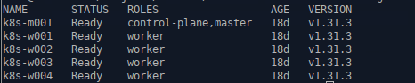
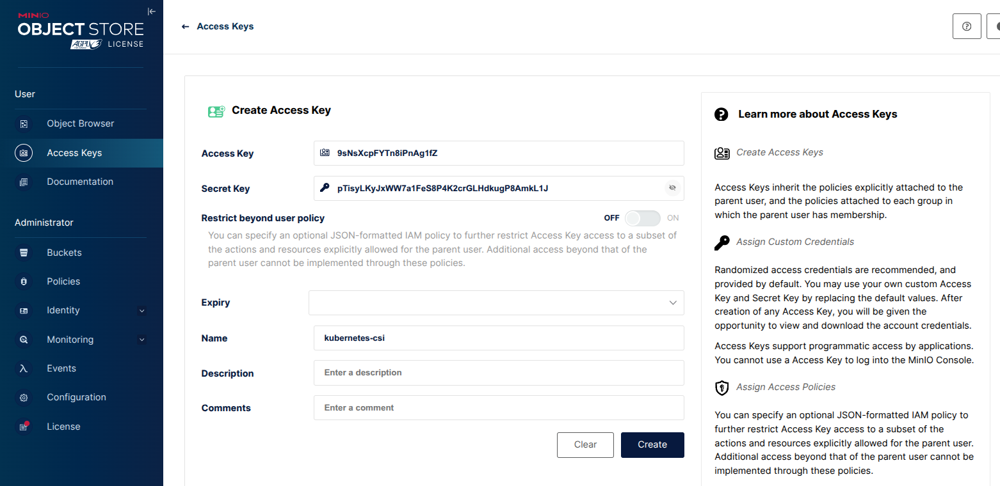
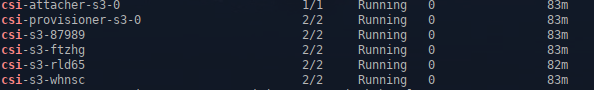
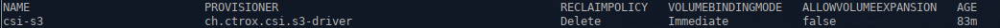
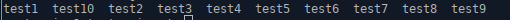
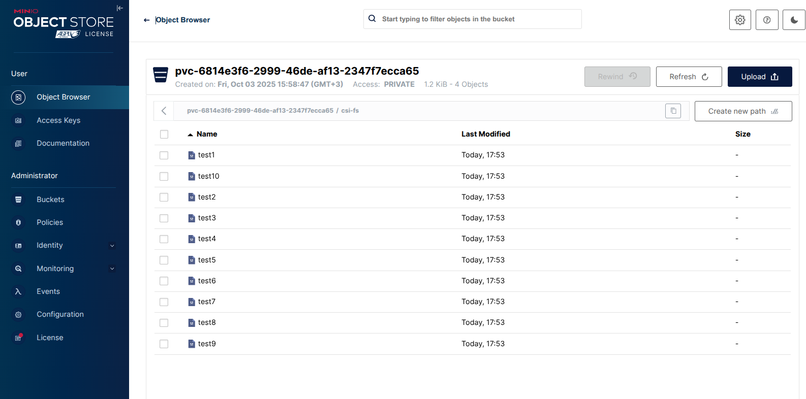

1. **Домашнее задание 12** 


* Данное задание будет выполняться в managed k8s в Yandex cloud
* Разверните managed Kubernetes cluster в Yandex cloud любым удобным вам способом, конфигурация нод не имеет значения
* Создайте бакет в s3 object storage Yandex cloud. Он будет использоваться для монтирования volume внутрь подов.
* Создайте ServiceAccount для доступа к бакету с правами, которые необходимы согласно инструкции YC и сгенерируйте
ключи доступа.
* Создайте secret c ключами для доступа к Object Storage и приложите манифест для проверки ДЗ
* Создайте storageClass описывающий класс хранилища и приложите манифест для проверки ДЗ
* Установите CSI driver из репозитория
* Создайте манифест PVC, использующий для хранения созданный вами storageClass с механизмом autoProvisioning и
приложите его для проверки ДЗ
* Создайте манифест pod или deployment, использующий созданный ранее PVC в качестве volume и монтирующий его в
контейнер пода в произвольную точку монтирования и приложите манифест для проверки ДЗ.
* Под в процессе работы должен производить запись в примонтированную директорию. Убедитесь, что файлы
действительно сохраняются в ObjectStorage.


<details>
  <summary>Решение:</summary>


Т.к. для ДЗ на моем стенде развернут k8s с пятью нодами, сервисы Яндекса использоваться не будут.





Под s3 хранилище, будем использовать развернутый в ДЗ-9 minio.


Создаем ключи доступа:



Установим хельм чартом ctrox-csi-s3.


ctrox-csi-s3 — это драйвер CSI, который позволяет монтировать бакеты S3-хранилища как файловые системы внутри подов Kubernetes.
Так объекты в бакетах становятся доступными для приложений внутри кластера, и для этого не нужно вносить изменения в код.


```
cd csi-s3
```


values.yaml:

```
attacher:
  image:
    repository: quay.io/k8scsi/csi-attacher
    pullPolicy: IfNotPresent
    tag: v3.0.0


secret:
  create: true
  name: csi-s3-secret
  accessKey: "9sNsXcpFYTn8iPnAg1fZ"
  secretKey: "pTisyLKyJxWW7a1FeS8P4K2crGLHdkugP8AmkL1J"
  endpoint: http://minio.minio02.svc.cluster.local:9000


storageClass:
  create: true
  name: csi-s3
  # Either s3fs, rclone, goofys or s3backer
  mounter: s3fs
  bucket: ""
  reclaimPolicy: Delete
  annotations: {}
  usePrefix:
  prefix:
  ignorePrefixErrors:

```


```
helmfile apply
```


```
kubectl get po -n kube-system | grep csi
```




```
kubectl get sc
```





Далее идем в контейнер csi-s3-test-nginx и выполняем команды в консоли:

```
kubectl exec -ti csi-s3-test-nginx -- /bin/bash
touch  /data/test{1,2,3,4,5,6,7,8,9,10}
ls /data/
```








</details>


