1. **Домашнее задание 13** 

* Данное задание можно выполнять как в minikube так и в managed k8s в Yandex cloud

* Создайте манифест, описывающий pod с distroless образом для создания контейнера, например kyos0109/nginx-distroless и
примените его в кластере. Приложите манифест к результатам ДЗ.

* С помощью команды kubectl debug создайте эфемерный контейнер для отладки этого пода. Отладочный контейнер должен
иметь доступ к пространству имен pid для основного контейнера пода.

* Получите доступ к файловой системе отлаживаемого контейнера из эфемерного. Приложите к результатам ДЗ вывод команды ls –la
для директории /etc/nginx

* Запустите в отладочном контейнере команду tcpdump -nn -i any -e port 80 (или другой порт, если у вас приложение на нем)

* Выполните несколько сетевых обращений к nginx в отлаживаемом поде любым удобным вам способом. Убедитесь что tcpdump
отображает сетевые пакеты этих подключений. Приложите результат работы tcpdump к результатам ДЗ.

* С помощью kubectl debug создайте отладочный под для ноды, на которой запущен ваш под с distroless nginx

* Получите доступ к файловой системе ноды, и затем доступ к логам пода с distrolles nginx. Приложите сами логи, и команду их
получения к результатам ДЗ.


<details>
  <summary>Решение:</summary>


Создаём манифест для pod с distroless образом

pod.yaml

```
---
apiVersion: v1
kind: Pod
metadata:
  name: web
  labels:
    app.kubernetes.io/name: web
spec:
  containers:
  - name: web
    image: kyos0109/nginx-distroless:1.18.0
    ports:
    - containerPort: 80
---

apiVersion: v1
kind: Service
metadata:
  namespace: default
  name: web
  labels:
    app.kubernetes.io/name: web
spec:
  ports:
    - port: 80
      targetPort: 80      
  selector:
    app.kubernetes.io/name: web
  type: ClusterIP 
```


Применяем

```
kubectl apply -f pod.yaml
```


```
kubectl get po,svc
```

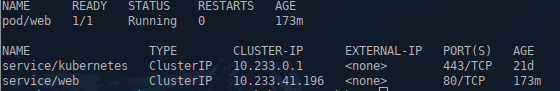


Подключаемся по ssh с пробросом порта 8080 на 80 порт web-контейнера

```
ssh root@192.168.15.101 -L 8080:web.default.svc.cluster.local:80
```


Проверим

```
curl http://127.0.0.1:8080
```


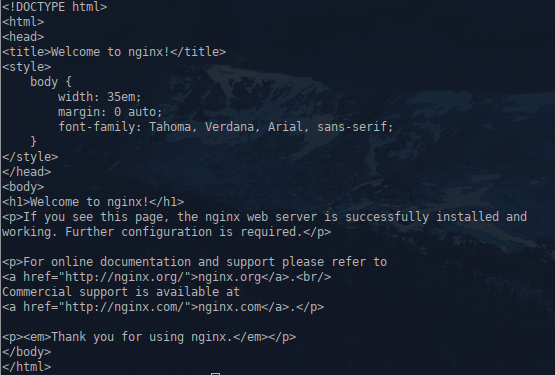


Создаем отладочный контейнер с доступом к PID web пода:


```
kubectl debug -it -c debugger --image=busybox:latest --target=web web
```


Проверка, что доступ к PID есть:


```
/ # ps aux
```


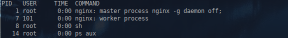


Проверка доступа к файловой системе пода:


```
/ # ls -la /proc/$(pgrep nginx | head -n1)/root/etc/nginx/
```

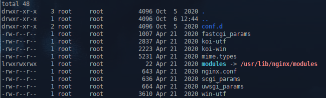


Для запуска tcpdump используем другой образ:

```
kubectl debug -it -c debugger-tcpdump --image=nicolaka/netshoot:latest --target=web web
```


```
tcpdump -nn -i any -e port 80
```


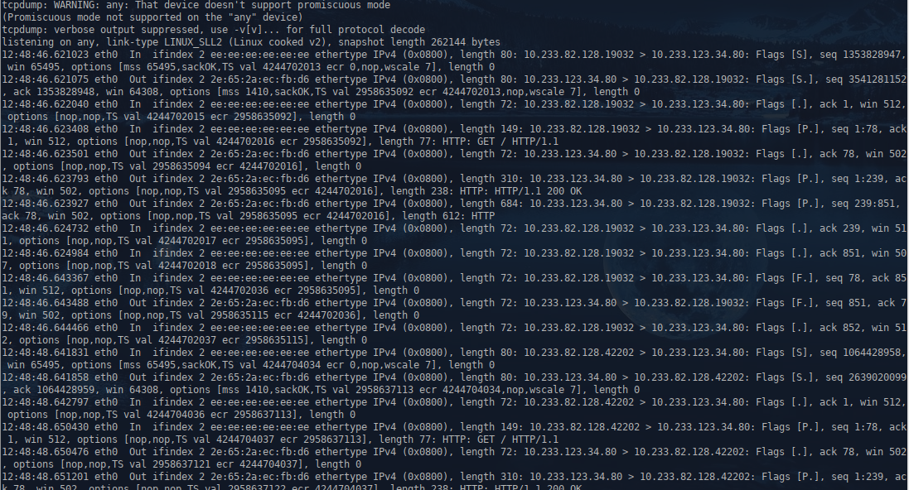


Отладка ноды:

Определяем ноду на которой развернут под


```
kubectl describe po web | grep "Node:"
```

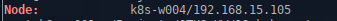


```
kubectl debug node/k8s-w004 -it --image=busybox:latest
```


```
/ # cat /host/var/log/pods/default_web_2bc51dc7-dc79-4b82-bbd3-7622f0b7e4b4/web/0.log
```

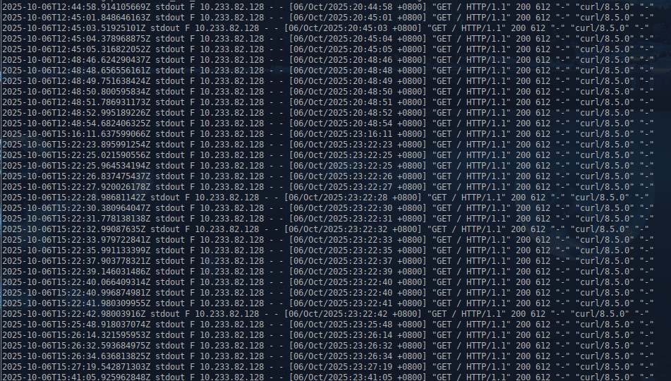


kubectl debug -it -c debugger-strace --profile=general --image=nicolaka/netshoot:latest --target=web web


</details>


  1.1  ___Задание с *___
* Выполните команду strace для корневого процесса nginx в рассматриваемом ранее поде. Опишите в результатах ДЗ какие
операции необходимо сделать, для успешного выполнения команды, и также приложите ее вывод к результатам ДЗ.


<details>
  <summary>Решение:</summary>

Устанавливаем nfs-subdir-external-provisioner
```
helm install second-nfs-subdir-external-provisioner nfs-subdir-external-provisioner/nfs-subdir-external-provisioner \
    --set nfs.server=y.y.y.y \
    --set nfs.path=/other/exported/path \
    --set storageClass.name=second-nfs-client \
    --set storageClass.provisionerName=k8s-sigs.io/second-nfs-subdir-external-provisioner \
    --set storageClass.reclaimPolicy=Retain
```


```
kubectl get sc
```
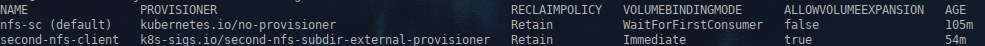


Меняем в манифесте pvc.yaml storageClassName

```
apiVersion: v1
kind: PersistentVolumeClaim
metadata:
  name: pvc001-web
  namespace: homework
spec:
  accessModes:
    - ReadWriteOnce
  resources:
    requests:
      storage: 50Mi
  storageClassName: "second-nfs-client"
  
```


Применяем:
```
kubectl delete -f deployment.yaml -f pvc.yaml
kubectl apply  -f pvc.yaml -f deployment.yaml
```

Проверяем:
```
kubectl get po -n homework
```
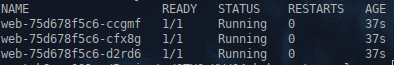
```
kubectl get pv
```
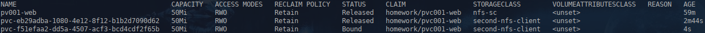

```
kubectl get pvc -n homework
```
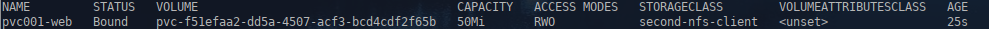


</details>
