1. **Домашнее задание 12** 


* Данное задание будет выполняться в managed k8s в Yandex cloud
* Разверните managed Kubernetes cluster в Yandex cloud любым удобным вам способом, конфигурация нод не имеет значения
* Создайте бакет в s3 object storage Yandex cloud. Он будет использоваться для монтирования volume внутрь подов.
* Создайте ServiceAccount для доступа к бакету с правами, которые необходимы согласно инструкции YC и сгенерируйте
ключи доступа.
* Создайте secret c ключами для доступа к Object Storage и приложите манифест для проверки ДЗ
* Создайте storageClass описывающий класс хранилища и приложите манифест для проверки ДЗ
* Установите CSI driver из репозитория
* Создайте манифест PVC, использующий для хранения созданный вами storageClass с механизмом autoProvisioning и
приложите его для проверки ДЗ
* Создайте манифест pod или deployment, использующий созданный ранее PVC в качестве volume и монтирующий его в
контейнер пода в произвольную точку монтирования и приложите манифест для проверки ДЗ.
* Под в процессе работы должен производить запись в примонтированную директорию. Убедитесь, что файлы
действительно сохраняются в ObjectStorage.


<details>
  <summary>Решение:</summary>


Т.к. для ДЗ на моем стенде развернут k8s с пятью нодами, сервисы Яндекса использоваться не будут.


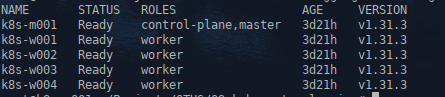


Для инфраструктурной ноды выбираем вторую воркер ноду, k8s-w002, и добавляем taint, запрещающий на нее планирование подов с посторонней нагрузкой.

```
kubectl taint node k8s-w002 node-role=infra:NoSchedule
```


```
kubectl get node -o wide --show-labels
```

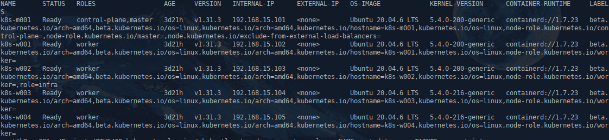


```
kubectl get nodes -o custom-columns=NAME:.metadata.name,TAINTS:.spec.taints
```


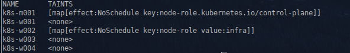


Под s3 хранилище, будем использовать minio, для этого соберем кастомный образ.


Dockerfile: 

```
FROM ubuntu:25.10
LABEL description="s3-minio"
ENV TZ=Europe/Moscow
RUN apt-get update -y && apt-get install apt-utils -y && apt-get install sudo -y 
RUN apt clean all
COPY "./minio" "/usr/local/bin/minio"
RUN chmod +x /usr/local/bin/minio
RUN touch /start.sh && chmod +x /start.sh
RUN echo '#!/bin/bash' >> /start.sh
RUN echo 'set -e' >> /start.sh
RUN echo ' ' >> /start.sh
RUN echo 'useradd minio -r;' >> /start.sh
RUN echo 'mkdir -p /minio/data;' >> /start.sh
RUN echo 'chown -R minio:minio /minio;' >> /start.sh
RUN echo 'sudo -u minio minio server --address :9000 --console-address :9001 /minio/data' >> /start.sh
CMD [ "/start.sh" ]

```


Деплоймент minio:

deployment.yaml

```
apiVersion: v1
kind: Namespace
metadata:
  name: storage-minio
  labels:
    name: storage-minio
    
---

apiVersion: v1
kind: PersistentVolumeClaim
metadata:
  name: pvc001-minio
  namespace: storage-minio
spec:
  accessModes:
    - ReadWriteOnce
  resources:
    requests:
      storage: 1Gi
  storageClassName: "second-nfs-client"
  
---

apiVersion: apps/v1
kind: Deployment
metadata:
  name: minio
  namespace: storage-minio
  labels:
    app.kubernetes.io/name: minio
spec:
  replicas: 1
  selector:
    matchLabels:
      app.kubernetes.io/name: minio
  template:
    metadata:
      labels:
        app.kubernetes.io/name: minio
    spec:
      containers:
        - name: minio
          image: rybnovn/minio:1.0
          volumeMounts:
            - name: minio-data
              mountPath: "/minio/data"
      
          ports:
            - containerPort: 9000
              name: http-data
            - containerPort: 9001
              name: http-admin         
              
      volumes:
        - name: minio-data
          persistentVolumeClaim:
            claimName: pvc001-minio
                
              


---

apiVersion: v1
kind: Service
metadata:
  namespace: storage-minio
  name: minio
  labels:
    app.kubernetes.io/name: minio
spec:
  ports:
    - port: 9000
      targetPort: 9000
      name: http-data
    - port: 9001
      targetPort: 9001
      name: http-admin       
  selector:
    app.kubernetes.io/name: minio
  type: ClusterIP 

```


Разворачиваем


```
kubectl apply -f ./minio/deployment.yaml
```

```
kubectl get po,svc -n storage-minio
```


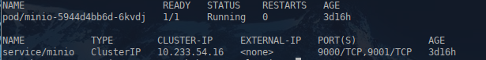


Подключаемся с пробросом порта на порт админки minio

```
ssh root@192.168.15.101 -L 9001:minio.storage-minio.svc.cluster.local:9001 
```


Создаем бакет

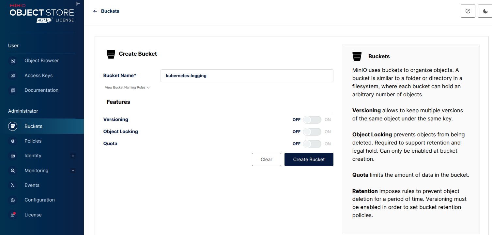


Создаем ключи

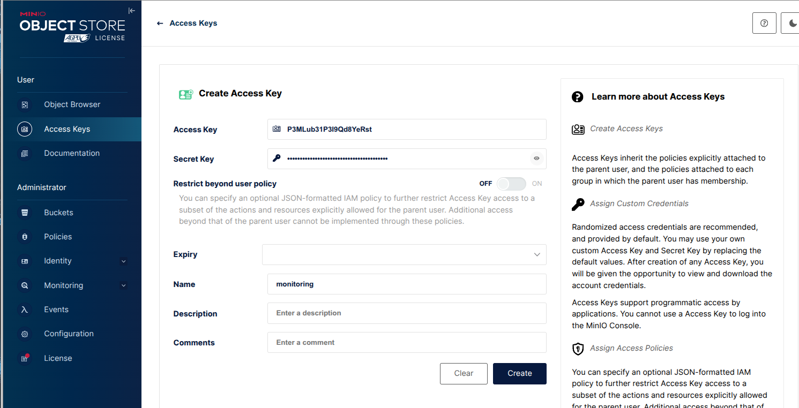


Устанавливаем  в кластер Loki

Файл values.yaml:


```
read:
  replicas: 1 
  tolerations:
  - key: "node-role"
    operator: "Equal"
    value: "infra"
    effect: "NoSchedule"
  affinity: 
    nodeAffinity:
      requiredDuringSchedulingIgnoredDuringExecution:
        nodeSelectorTerms:
        - matchExpressions:
          - key: role
            operator: In
            values:
            - infra
gateway:
  tolerations:
  - key: "node-role"
    operator: "Equal"
    value: "infra"
    effect: "NoSchedule"
  affinity: 
    nodeAffinity:
      requiredDuringSchedulingIgnoredDuringExecution:
        nodeSelectorTerms:
        - matchExpressions:
          - key: role
            operator: In
            values:
            - infra
  nginxConfig:
    resolver: "coredns.kube-system.svc.cluster.local"
  
  
  
  
  
  
backend:
  replicas: 1 
  tolerations:
  - key: "node-role"
    operator: "Equal"
    value: "infra"
    effect: "NoSchedule"
  affinity: 
    nodeAffinity:
      requiredDuringSchedulingIgnoredDuringExecution:
        nodeSelectorTerms:
        - matchExpressions:
          - key: role
            operator: In
            values:
            - infra
write:
  replicas: 1 
  tolerations:
  - key: "node-role"
    operator: "Equal"
    value: "infra"
    effect: "NoSchedule"
  affinity: 
    nodeAffinity:
      requiredDuringSchedulingIgnoredDuringExecution:
        nodeSelectorTerms:
        - matchExpressions:
          - key: role
            operator: In
            values:
            - infra
loki:
  auth_enabled: false
  commonConfig:
    replication_factor: 1
  storage:
    type: s3
    bucketNames:
      chunks: minio              # Подключение к minio
      ruler: minio
      admin: minio
    s3:
      endpoint: storage-minio.svc.cluster.local:9000/kubernetes-logging
      accessKeyId: P3MLub31P3I9Qd8YeRst
      secretAccessKey: C7jPKq1pI1BiPDHhAcW17D6on0KqftCmMKQhH5hc
      s3ForcePathStyle: false
      insecure: true
  schemaConfig:
    configs:
    - from: 2024-04-26
      object_store: s3
      store: tsdb
      schema: v13
      index:
        prefix: index_
        period: 24h
test:
  enabled: false
selfMonitoring: 
  enabled: false
lokiCanary:
  enabled: false
chunksCache:
  allocatedMemory: 200
  tolerations:
  - key: "node-role"
    operator: "Equal"
    value: "infra"
    effect: "NoSchedule"
  affinity: 
    nodeAffinity:
      requiredDuringSchedulingIgnoredDuringExecution:
        nodeSelectorTerms:
        - matchExpressions:
          - key: role
            operator: In
            values:
            - infra
resultsCache:
  allocatedMemory: 200
  tolerations:
  - key: "node-role"
    operator: "Equal"
    value: "infra"
    effect: "NoSchedule"
  affinity: 
    nodeAffinity:
      requiredDuringSchedulingIgnoredDuringExecution:
        nodeSelectorTerms:
        - matchExpressions:
          - key: role
            operator: In
            values:
            - infra

```


```
cd ./loki
```


```
helmfile apply
```


Проверяем

```
kubectl get po -n monitoring
```
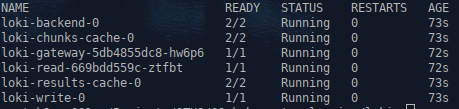


Файлы в бакет прилетели

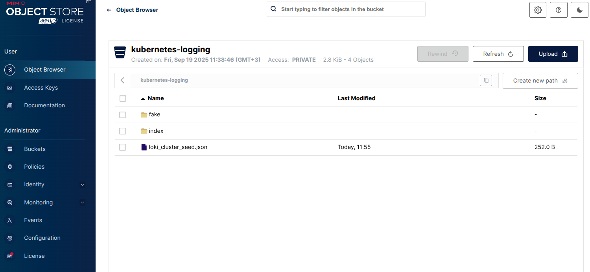


Устанавливаем Promtail


```
cd ../promtail
```


Файл values.yaml:


```
config:
  clients:
    - url: http://loki-gateway.monitoring.svc.cluster.local/loki/api/v1/push
      tenant_id: 1
tolerations:
- key: "node-role"
  operator: "Equal"
  value: "infra"
  effect: "NoSchedule"

```


```
helmfile apply
```


Проверяем

```
kubectl get po -n monitoring
```
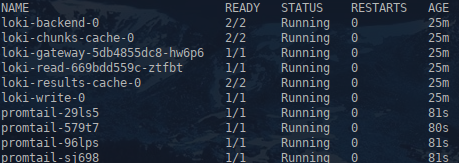


Устанавливаем Grafana


```
cd ../grafana
```


Файл values.yaml:


```
tolerations:
- key: "node-role"
  operator: "Equal"
  value: "infra"
  effect: "NoSchedule"
affinity: 
  nodeAffinity:
    requiredDuringSchedulingIgnoredDuringExecution:
      nodeSelectorTerms:
      - matchExpressions:
        - key: role
          operator: In
          values:
          - infra
datasources:
  datasources.yaml:
    apiVersion: 1
    datasources:
    - name: loki
      type: loki
      isDefault: true
      url: http://loki-gateway.monitoring.svc.cluster.local

```


```
helmfile apply
```


Проверяем

```
kubectl get po -n monitoring
```
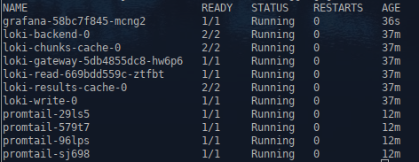


Подключаемся к кластеру с пробросом порта на порт grafana


```
ssh root@192.168.15.101 -L 3000:grafana.monitoring.svc.cluster.local:80
```

Смотрим пароль admin в grafana

```
kubectl get secret --namespace monitoring grafana -o jsonpath="{.data.admin-password}" | base64 --decode ; echo
```


Заходим в графану, выбираем источник данных loki, смотрим, что данные пошли


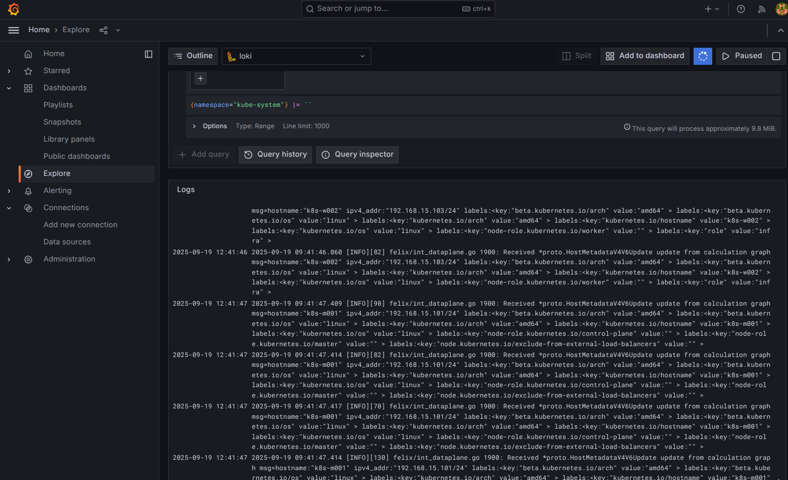


</details>


