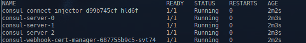
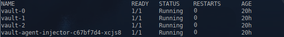

1. **Домашнее задание 11** 


* Данное задание будет выполняться в managed k8s в Yandex cloud
* Разверните managed Kubernetes cluster в Yandex cloud любым удобным вам способом. Создайте 3 ноды для кластера
* В namespace consul установите consul из helm-чарта https://github.com/hashicorp/consul-k8s.git с параметрами 3
реплики для сервера. Приложите команду установки чарта и файл с переменными к результатам ДЗ.
* В namespace vault установите hashicorp vault из helm-чарта https://github.com/hashicorp/vault-helm.git
  * Сконфигурируйте установку для использования ранее установленного consul в HA режиме
  * Приложите команду установки чарта и файл с переменными к результатам ДЗ.
* Выполните инициализацию vault и распечатайте с помощью полученного unseal key все поды хранилища
* Создайте хранилище секретов otus/ с Secret Engine KV, а в нем секрет otus/cred, содержащий username='otus' password='asajkjkahs’
* В namespace vault создайте serviceAccount с именем vault-auth и ClusterRoleBinding для него с ролью system:auth-delegator.
Приложите получившиеся манифесты к результатам ДЗ
* В Vault включите авторизацию auth/kubernetes и сконфигурируйте ее используя токен и сертификат ранее созданного ServiceAccount
* Создайте и примените политику otus-policy для секретов /otus/cred с capabilities = [“read”, “list”]. Файл .hcl с политикой приложите к
результатам ДЗ

* Создайте роль auth/kubernetes/role/otus в vault с использованием ServiceAccount vault-auth из namespace Vault и политикой otus-policy
* Установите External Secrets Operator из helm-чарта в namespace vault. Команду установки чарта и файл с переменными, если вы их
используете приложите к результатам ДЗ
* Создайте и примените манифест crd объекта SecretStore в namespace vault, сконфигурированный для доступа к KV секретам
Vault с использованием ранее созданной роли otus и сервис аккаунта vault-auth. Убедитесь, что созданный SecretStore успешно
подключился к vault. Получившийся манифест приложите к результатам ДЗ.
* Создайте и примените манифест crd объекта ExternalSecret с следующими параметрами:
  * ns – vault
  * SecretStore – созданный на прошлом шаге
  * Target.name = otus-cred
  * Получает значения KV секрета /otus/cred из vault и отображает их в два ключа – username и password соответственно
* Убедитесь, что после применения ExternalSecret будет создан Secret в ns vault с именем otus-cred и хранящий в себе 2 ключа
username и password, со значениями, которые были сохранены ранее в vault. Добавьте манифест объекта ExternalSecret к результатам ДЗ.


<details>
  <summary>Решение:</summary>


Т.к. для ДЗ на моем стенде развернут k8s с пятью нодами, сервисы Яндекса использоваться не будут.


Убираем taint с ноды k8s-w002, оставшийся с прошлых ДЗ.

```
kubectl taint node k8s-w002 node-role=infra:NoSchedule-
```


Пулим через vpn helm чарты consul,  external-secrets, vault и кладем их в каталог charts

Устанавливаем consul и vault

```
cd charts
kubectl create ns consul
helm install consul consul-1.4.3.tgz --set global.name=consul --set server.replicas=3 -n consul
```

```
kubectl get po -n consul
```



```
cd ../vault
```

values.yaml:
```
---
server:
   ha:
    enabled: true
    replicas: 3
    config: |
      ui = true

      listener "tcp" {
        tls_disable = 1
        address = "[::]:8200"
      }
      storage "consul" {
        address = "consul-server.consul:8500"
        path = "vault"
      }

      service_registration "kubernetes" {}

```


```
helmfile apply
```


```
kubectl get po -n vault
```



</details>


