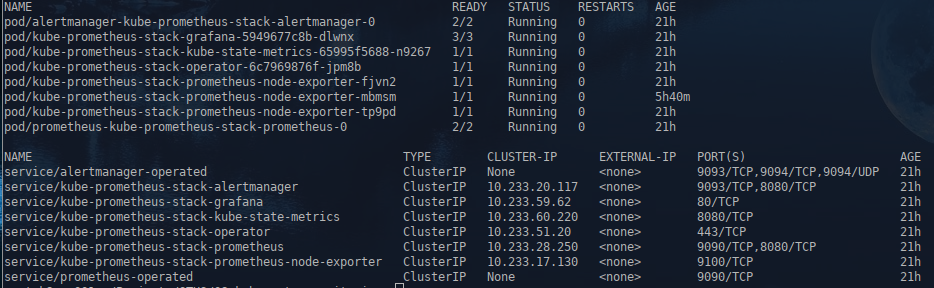
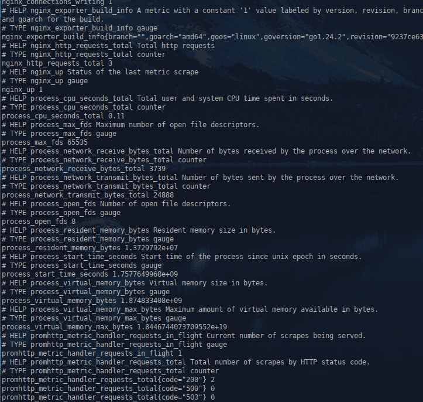
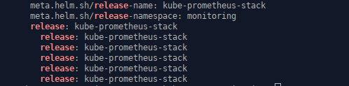
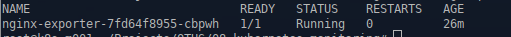
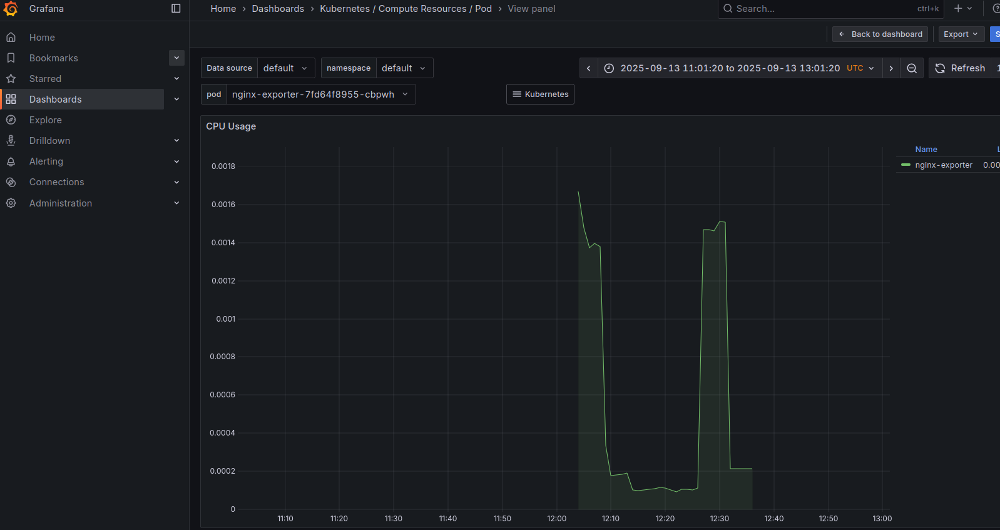
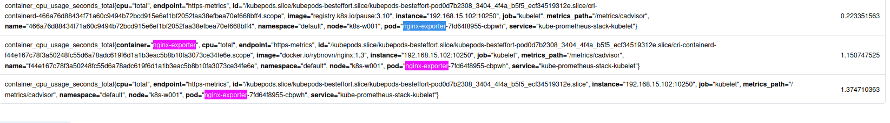

1. **Домашнее задание 8** 


* Необходимо создать кастомный образ nginx, отдающий свои метрики на определенном endpoint ( пример из офф документации в разделе ссылок)
* Установить в кластер Prometheus-operator любым удобным вам способом (рекомендуется ставить или по ссылке из офф документации, либо через helm-чарт)
* Создать deployment запускающий ваш кастомный nginx образ и service для него. 
* Настроить запуск nginx prometheus exporter (отдельным подом или в составе пода с nginx – не принципиально) и сконфигурировать его для сбора метрик с nginx
* Создать манифест serviceMonitor, описывающий сбор метрик с подов, которые вы создали


<details>
  <summary>Решение:</summary>


Устанавливаем оператор Prometheus через helm.


kubectl get pod -n monitoring

```
helm install kube-prometheus-stack oci://ghcr.io/prometheus-community/charts/kube-prometheus-stack --namespace monitoring --create-namespace
```

```
kubectl get po,svc -n monitoring

```




Соберем кастомный образ nginx, добавив в него собраный ранее nginx-prometheus-exporter, исходники были взяты тут: https://github.com/nginxinc/nginx-prometheus-exporter.git.

Dockerfile

```
FROM ubuntu:25.10
LABEL description="Nginx-metrics"
ENV TZ=Europe/Moscow
RUN apt-get update -y && apt-get install apt-utils -y && apt-get install nginx -y 
RUN apt clean all
COPY "./nginx-prometheus-exporter" "/usr/local/bin/nginx-prometheus-exporter"
RUN chmod +x /usr/local/bin/nginx-prometheus-exporter
RUN rm -rf /etc/nginx/sites-enabled/*
RUN rm -rf /etc/nginx/sites-available/default
COPY "./default" "/etc/nginx/sites-available/default"
RUN ln -s /etc/nginx/sites-available/default /etc/nginx/sites-enabled/default

RUN touch /start.sh && chmod +x /start.sh
RUN echo '#!/bin/bash' >> /start.sh
RUN echo 'set -e' >> /start.sh
RUN echo ' ' >> /start.sh
RUN echo '/etc/init.d/nginx start;' >> /start.sh
RUN echo 'sleep 5' >> /start.sh
RUN echo '/usr/local/bin/nginx-prometheus-exporter -nginx.scrape-uri=http://127.0.0.1:80/server-status &' >> /start.sh
RUN echo 'sleep 5' >> /start.sh
RUN echo 'tail -f /dev/null' >> /start.sh
CMD [ "/start.sh" ]

```


Создаем deployment с кастомным образом nginx


deploy-nginx-exporter.yaml:
```
apiVersion: apps/v1
kind: Deployment
metadata:
  name: nginx-exporter
spec:
  replicas: 1
  selector:
    matchLabels:
      app: nginx-exporter
  template:
    metadata:
      labels:
        app: nginx-exporter
    spec:
      containers:
        - name: nginx-exporter
          image: rybnovn/nginx:1.3
          ports:
            - containerPort: 9113
              name: http 
            


---

apiVersion: v1
kind: Service
metadata:
  name: nginx-exporter
spec:
  selector:
    app: nginx-exporter
  ports:
    - protocol: TCP
      port: 9113
      targetPort: 9113
      name: http

```

Применяем:


```
kubectl apply -f ./deploy-nginx-exporter.yaml

```


Проверяем, что метрики отдаются:

```
curl http://nginx-exporter.default.svc.cluster.local:9113/metrics

```




Создаём Servicemonitor который используется операратором Prometheus для автоматического обнаружения и сбора метрик


sm.yaml:
```
apiVersion: monitoring.coreos.com/v1
kind: ServiceMonitor
metadata:
  name: nginx-exporter-monitor
  labels:
    release: kube-prometheus-stack
spec:
  selector:
    matchLabels:
      app: nginx-exporter
  namespaceSelector:
    matchNames:
      - default
  endpoints:
    - port: http
      interval: 15s


```


kube-prometheus-stack - это release name, Helm автоматически добавляет этот label во все связанные объекты

Проверяем что это так:

```
kubectl get prometheus -n monitoring -o yaml | grep release
```




Применяем Servicemonitor:


```
kubectl apply -f ./sm.yaml

```


Подключаемся к кластеру с пробросом портов в prometheus и grafana
```
ssh root@192.168.15.101 -L 9090:kube-prometheus-stack-prometheus.monitoring.svc.cluster.local:9090 -L 3000:kube-prometheus-stack-grafana.monitoring.svc.cluster.local:80
```


Проверяем что pod встал на мониторинг









</details>


